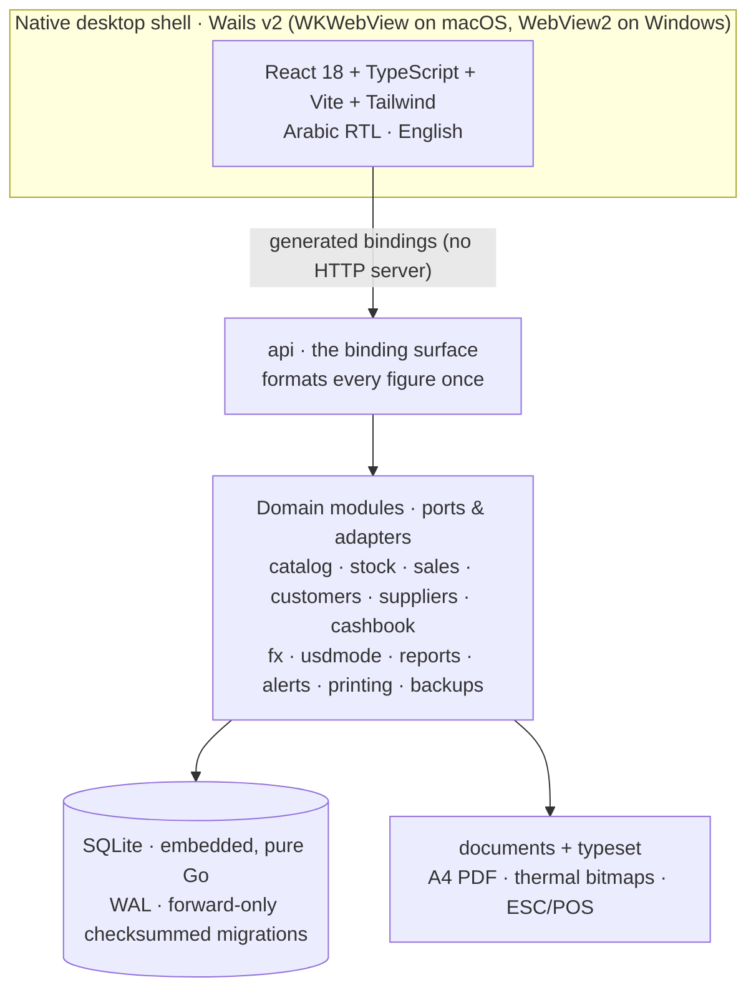

<div align="center">

# Mizan Lite · ميزان لايت

**An offline-first desktop POS and lightweight multi-currency ERP for retail shops —
written in Go, packaged natively for macOS and Windows.**

*Offline-first architecture · Dual & USD-only currency engine · Real-time business analytics*


[**Download**](../../releases/latest) · [Features](#key-features) · [Architecture](#technical-architecture) ·
[Build from source](#build-from-source) · [Documentation](#documentation)

</div>

---

## Why Mizan Lite exists

A shop in a market with a fast-moving local currency lives with two currencies at the same counter. Prices are set in
dollars and paid in pounds, or the other way round. Customers run up debts in either one, and the exchange rate moves
under all of it. Meanwhile the internet and the power are not guaranteed.

Mizan Lite is built for that shop. It runs entirely on one computer, with no server, no account and no connection
required. It keeps every figure **exact**: money is never a floating-point number. And it handles the two currencies as
two currencies, never adding them together behind the owner's back. It is Arabic-first (right-to-left) with a full
English interface.

## Highlights

| | |
|---|---|
| **Offline-first** | One installer, one local SQLite database, no server and no sign-in. The only optional network use is fetching the day's exchange rate. Manual rates are the default. |
| **Dual & USD-only currency engine** | Every sale settles in dollars or pounds. Debts are kept per currency, and the pound reads old, new (the redenomination) or both. A shop can go **US dollars only**: every price, balance and the drawer is converted in one confirmed step, after which no pound figure appears anywhere. |
| **Real-time business analytics** | Profit for the day, the month and each product, the stock's value, the drawer's expected cash against its count, and alerts for low stock, prices the rate has left behind and capital measured in dollars. All of it is computed live from the books. |

## Key features

**Point of sale**
- Barcode scanning, a grid of quick buttons, weighed goods, held sales and an open-priced "misc" item.
- Keyboard-driven checkout: F9 pays, F4 switches to credit.
- Discounts and voids are protected by the owner's PIN. Cash is rounded to the nearest paper note, and change can be given in either currency.

**Multi-currency, dynamically switched (USD / SYP)**
- The rate is entered by hand or fetched automatically, and a large jump asks for confirmation.
- Each sale's rate is kept with it forever.
- An optional re-pricing proposal follows a rate move.
- Dollars-only mode converts the whole shop from a plan the owner reviews figure by figure.

**Store branding & documents**
- Store name, phone, city, address and an **uploaded logo** head every receipt, every A4 invoice and the application's header.
- **A4 invoices**, with the amount in words (تفقيط), are printed or saved as PDF.
- **80 mm / 58 mm thermal receipts** go through the system driver or raw ESC/POS.
- Shelf labels carry Code 128 barcodes.
- Arabic is shaped in Go by a port of HarfBuzz, so printouts look identical on every machine.

**Inventory & spoilage**
- Weighted-average cost, deliveries, stock counts and reorder levels.
- Packages that open into loose units.
- Write-offs by reason (damaged, expired, spoiled), and a losses report at cost.

**Suppliers & debt ledger**
- Supplier purchases with line and invoice discounts. Goods damaged on arrival are not charged.
- Payables, and payments made from the drawer or from the owner's own pocket.
- Customer credit sales with repayments, vouchers, statements and write-offs, one ledger per currency.

**Cash drawer & reports**
- Expected against counted cash, expenses and withdrawals, and an end-of-day (Z) report.
- Day, month, product and stock reports, exported to Excel and PDF, and an Excel import for the first catalogue.

**Safety**
- Verified backups every day, on close and before any upgrade, with an optional copy to a USB drive or synced folder.
- Restore requires the owner's PIN, states exactly what would be lost and keeps a safety snapshot.

## Screenshots

> Screenshots are coming. Add PNGs to `assets/screenshots/` and uncomment the lines below.

<!--
| Till | A4 invoice | Suppliers |
|---|---|---|
|  |  |  |
| **Reports** | **Customers & debts** | **Dollars-only switch** |
|  |  |  |
-->

## Download & quick start

Pre-compiled builds are published on the [**Releases**](../../releases/latest) page:

| Platform | File | Notes |
|---|---|---|
| macOS 13+ (Apple silicon and Intel) | `Mizan.Lite.<version>.dmg` | a universal application; drag it to Applications |
| Windows 10/11 (64-bit) | `Mizan.Lite.<version>.Setup.exe` | installer, with the WebView2 runtime included, so it installs offline |
| Windows 10/11 (64-bit) | `Mizan.Lite.<version>.exe` | portable, with no installation |

Each release carries a `SHA256SUMS-<version>.txt`. Check your download against it, in the folder you downloaded to:

```bash
shasum -a 256 -c SHA256SUMS-0.10.1.txt --ignore-missing          # macOS / Linux
Get-FileHash .\Mizan.Lite.0.10.1.Setup.exe -Algorithm SHA256      # Windows PowerShell: compare with the file
```

> **The builds are not code-signed yet.** On macOS, open the app once with right-click → **Open**, or use
> System Settings → Privacy & Security → **Open Anyway**. On Windows, SmartScreen shows **More info → Run anyway**.

**First run:** name the shop, choose the language, set a 6–12-digit owner PIN and keep the recovery code it shows once.
Then enter today's exchange rate. The shop guide ([English](docs/mizan_lite/guide/SHOP_GUIDE.md) ·
[العربية](docs/mizan_lite/guide/SHOP_GUIDE.ar.md)) walks through a day at the counter, and is also built into the
application as a PDF (About → Guides).

## Technical architecture



| Layer | Technology |
|---|---|
| Backend | **Go** (modular monolith, ports & adapters). No CGO: `modernc.org/sqlite` is a pure-Go SQLite. |
| Database | **SQLite**, embedded, one file per shop, with a pre-migration snapshot before every upgrade |
| Desktop shell | **Wails v2**: the operating system's own webview, with a single-instance lock and native file dialogs |
| Frontend | **React 18 · TypeScript · Vite · Tailwind CSS** |
| Printing | Go-rendered A4 PDFs and 1-bit thermal bitmaps, shaped by `go-text/typesetting` (HarfBuzz port) |
| Packaging | a universal macOS `.dmg`, and an NSIS Windows installer with offline WebView2 plus a portable `.exe`, cross-compiled from one machine |

**Engineering decisions worth reading:**
- **Money is never a float.** Amounts travel as exact decimal strings and are stored as integer minor units, with
  overflow-checked arithmetic. The redenominated pound passes through one conversion pipeline, which a gate test enforces.
- **Every module is isolated.** Architecture rules (`arch-rules.yml`, checked by [archlint](tools/archlint/README.md))
  forbid illegal imports, and each rule is proven by planting a violation and watching it fail.
- **The database can only move forward.** Migrations are checksummed, and every past schema version is kept as a
  fixture and upgraded in CI with every row compared.
- **Tests at every level.** Fakes are held honest by contract suites run against real SQLite. Around 700 frontend unit
  tests and 75 Go packages run under the race detector. 32 end-to-end journeys (16 in each language) drive the real
  screens in a real browser against the real Go backend.

## Build from source

**Prerequisites:**
- Go 1.26+
- Node.js 22 and npm
- the Wails CLI: `go install github.com/wailsapp/wails/v2/cmd/wails@v2.13.0`
- for the Windows installer: NSIS (`brew install makensis`) and the offline WebView2 runtime (`scripts/fetch-webview2.sh`)

```bash
make lite-ci              # the full local CI: Go (race), archlint + drills, lint, frontend, end-to-end journeys
make lite-build-macos     # universal .app → apps/lite/build/bin/
make lite-build-windows   # Windows .exe, cross-compiled
make lite-release         # from a clean, tagged tree: CI, both packages, a smoke test, checksums → dist/lite/
```

Try it with a demo shop, seeded through the application's own services into a folder of your choice:

```bash
MIZAN_LITE_DATA_DIR=~/Desktop/lite-demo go run ./cmd/lite-demoseed -pin 481537
MIZAN_LITE_DATA_DIR=~/Desktop/lite-demo "/Applications/Mizan Lite.app/Contents/MacOS/Mizan Lite"
```

## Repository layout

This repository holds two editions that share one kernel:

| Path | What it is |
|---|---|
| `apps/lite/` | **Mizan Lite**, the desktop application: Wails shell and React frontend |
| `internal/lite/` | Mizan Lite's domain modules, bindings, documents and tests |
| `cmd/lite-*` | the demo seeder, the end-to-end test bridge and the guide renderer |
| `docs/mizan_lite/` | every Mizan Lite document: design, decisions, phase records, guides |
| `internal/kernel`, `internal/platform` | the shared kernel: money, clocks, errors, database, migrations, backups, i18n |
| root `main.go`, `frontend/`, the rest of `internal/`, `docs/architecture/` | **Mizan**, the full double-entry ERP edition. See [MIZAN_ERP.md](MIZAN_ERP.md) |

## Documentation

**Mizan Lite**
- [Documentation index](docs/mizan_lite/README.md) — design, decisions, progress
- [Design](docs/mizan_lite/DESIGN.md) · [Decision register](docs/mizan_lite/DECISIONS.md) · [Release process](docs/mizan_lite/RELEASE.md)
- [Installation guide](docs/mizan_lite/guide/INSTALL.md) · [دليل التثبيت](docs/mizan_lite/guide/INSTALL.ar.md)
- [Troubleshooting](docs/mizan_lite/guide/TROUBLESHOOTING.md) · [حل المشكلات](docs/mizan_lite/guide/TROUBLESHOOTING.ar.md)
- [System documentation](MIZAN_LITE_SYSTEM_DOCUMENTATION.md) — a full architecture reference, written at 0.9.6

**Mizan (full edition)**
- [Overview](MIZAN_ERP.md) · [Getting started](docs/guide/GETTING_STARTED.md) · [البدء](docs/guide/GETTING_STARTED.ar.md)
- [Architecture](docs/architecture/ARCHITECTURE_v1.md) · [Known gaps](docs/architecture/KNOWN_GAPS.md)

## Project status

**0.10.1: a pilot release**, shaped by several rounds of hands-on feedback from a shop owner. Before 1.0.0 it still
needs code-signed builds, a completed Windows field protocol, and printing checked on more thermal printers.

Issues and pull requests are welcome. Please open an issue to discuss a change before sending a large one.

## License

Released under the [MIT License](LICENSE) © 2026 Rony Zenalden.

Third-party components keep their own licences, listed in
[`internal/lite/notices/THIRD_PARTY_NOTICES.txt`](internal/lite/notices/THIRD_PARTY_NOTICES.txt). The bundled IBM Plex
Sans Arabic font is under the SIL Open Font License. Brand assets under `assets/brands/` belong to their owners and are
**not** covered by the MIT License.
