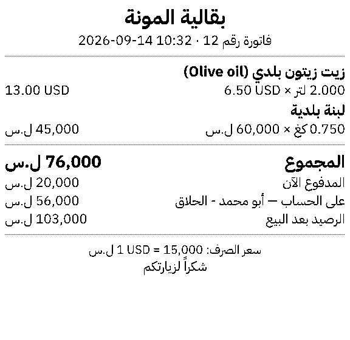
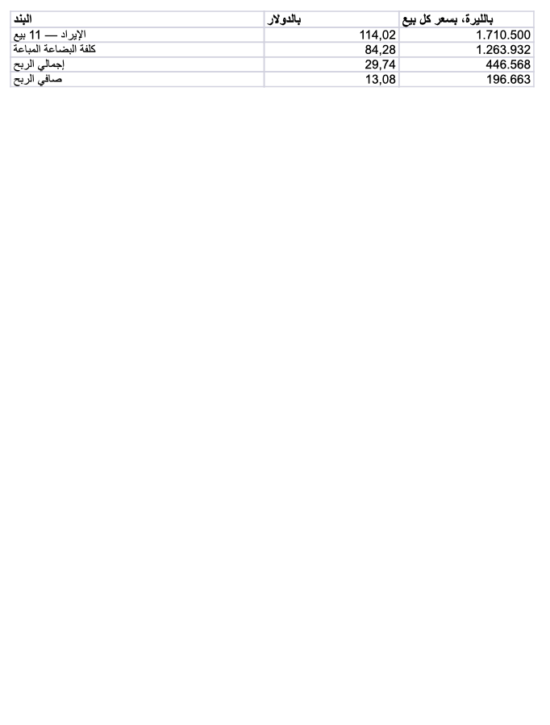
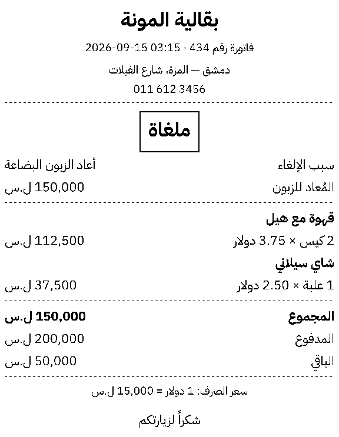
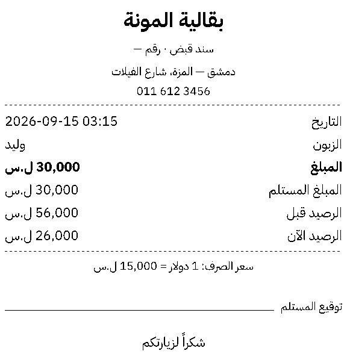
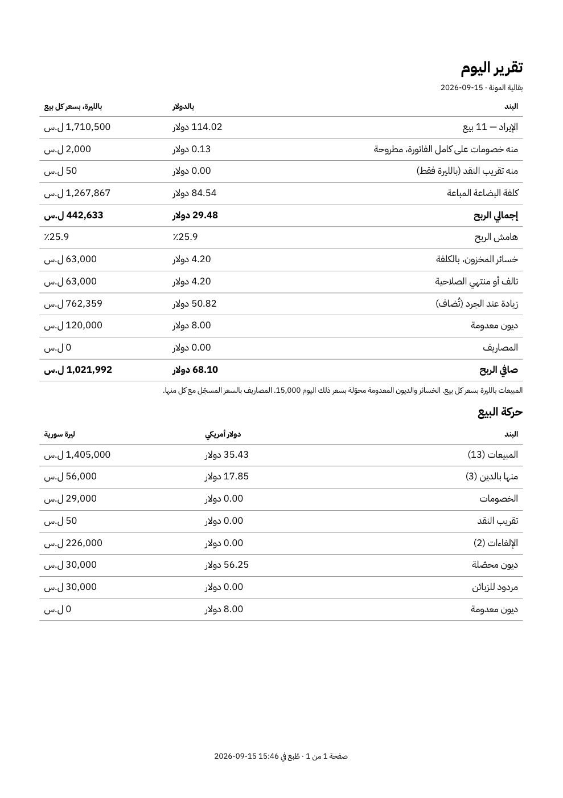
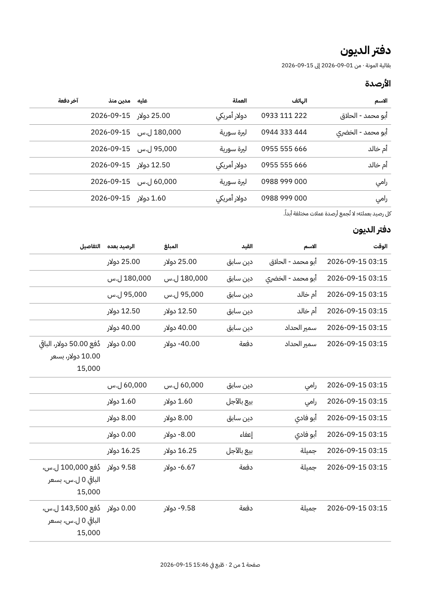
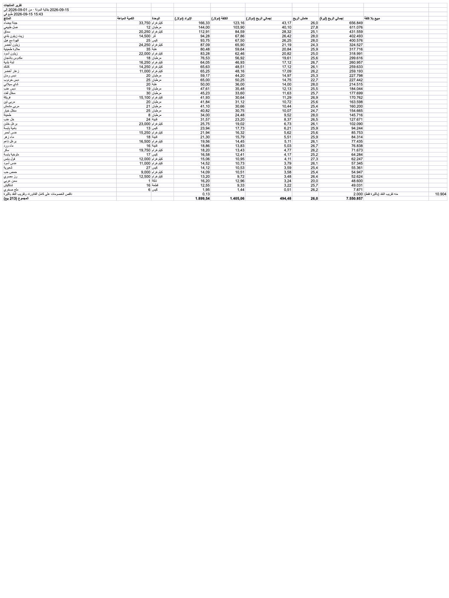

# Mizan Lite — Phase L7: export, thermal printing, backup and restore (التصدير والطباعة والنسخ الاحتياطي)

> **Status: COMMITTED — two checks remain with the owner:** a receipt printed on the shop's thermal printer and an export
> opened in Excel (§22, PROGRESS O14). The note, D-L7.1–18, the owner's answers and D-L7.i1–i19 were approved on 2026-09-15;
> what was built, found and verified is recorded in §15–§22.
> **Date:** 2026-09-15. **Base:** L6 (`2c86f17`). **Requirements:** the owner's of 2026-09-15 — export every financial
> report, statement, the sales history and the customer debt ledgers to **Excel (.xlsx) and PDF**; print **80 mm thermal**
> sale receipts, credit receipts and debt payment vouchers; **automated local backup and one-click restore**. They replace
> [L6_REPORTS.md](L6_REPORTS.md) Q-L6.9's "no export" and [L4_TILL.md](L4_TILL.md) §2.3's "receipts and a backups screen".
> **Design:** [../DESIGN.md](../DESIGN.md) §6.4 (backups), §10 (L7), Q-L4.9 (80 mm thermal). Prior phases: L4 (what a receipt
> records), L5 (debt entries, the cash of a payment), L6 (every report this phase exports).

---

## 0. How to read this

| § | Content |
|---|---|
| 1 | Analysis — the three requirements, and **nine things harder than they look, four of them found by a spike before this note** |
| 2 | Scope — in, out, what remains for L8, and six amendments |
| 3 | **One document, three outputs** — the layout model, Arabic shaping, the embedded font, the bidi rule |
| 4 | **Export** — what is exported, how Excel and PDF are made, how a file reaches the disk |
| 5 | **Thermal printing** — the receipts and vouchers, ESC/POS raster, the printer queue, failures |
| 6 | **Backup and restore** — what exists, what is missing, the automatic schedule, the outside copy, one-click restore |
| 7 | The schema — `0008_printing.sql` |
| 8 | Architecture — five modules, the dependencies, the rules |
| 9 | Bindings and screens |
| 10 | Who may do what |
| 11 | **Verified before this note** — the spike, with its images |
| 12 | Tests, drills, Definition of Done |
| 13 | (reserved) |
| 14 | **Decisions and questions for approval** |
| 15–22 | **The record:** at approval, what was built, decisions made while building, findings, evidence, drills, not verified, done |

---

## 1. ANALYSIS

### 1.1 What the owner asked for

1. **Every financial figure leaves the application as a file** — the Day, Month, Products and Stock reports, the cash drawer,
   a customer's statement, the sales history, the customer debt ledgers — as a spreadsheet to work with and a PDF to send or
   keep.
2. **A receipt comes out of the till printer** when a sale is made — cash or credit — and a voucher when a debt is paid.
3. **The shop's data survives a lost or broken computer** without anyone remembering to do anything, and going back to a
   backup is one deliberate act.

### 1.2 Nine things harder than they look

**H1 — The webview cannot be the printer.** Mizan prints and makes PDFs through the browser's print dialog
(`platform/tabular.PrintableHTML`, `frontend/src/modules/sales/print.ts`). **Read in Wails v2.13's source for this note:** on
macOS the only print Wails implements is `WindowPrint` — an `NSPrintOperation` over **the whole application window**, forced to
**landscape with zero margins**; a search of its macOS sources finds no handler for a page's own `window.print()`. On Windows `WindowPrint` runs
`window.print()` in WebView2 — **never run here** (O1). An 80 mm receipt, or an A4 report without the application's chrome,
cannot be produced that way on macOS, and cannot be verified on Windows. L7 therefore lays out documents **in Go** and hands the
operating system finished bytes (§3).

**H2 — Arabic has to be shaped, and a Go program does not do it by default.** Arabic letters change form with their
neighbours; lam-alef is one glyph; digits and Latin run left to right inside right-to-left text. Mizan's ESC/POS renderer
**refuses any character beyond Latin-1** for this reason (`printing.requireASCII`). The spike (§11) shaped Arabic with
`go-text/typesetting` — a Go port of HarfBuzz, the shaper inside Chrome and Android — and an embedded OFL font: joined letters,
ligatures and mixed Latin are correct in both outputs (§11, image 1).

**H3 — Found by the spike: a figure in right-to-left text prints backwards unless it is isolated.** Laid out as plain text in
an Arabic line, `2026-09-14 10:32` printed as **`10:32 14-09-2026`** and `13.00 USD` as **`USD 13.00`** — the Unicode bidi
algorithm doing what it must. The screen avoids it with `<bdi dir="ltr">` around every figure (L4 `Money`); a printout has no
`<bdi>`. Wrapping each figure in **LRI … PDI** (U+2066, U+2069) fixed every case (§11, image 1). D-L7.3 makes it the one rule, and
a test holds every document to it.

**H4 — Found by the spike: a PDF's copy-paste text needs the invisible marks removed.** The first PDF rendered correctly and its
text could be selected, but extraction joined words with U+2069 instead of spaces: the text map (`ToUnicode`) had mapped glyphs
to the isolate marks around them. Harmless on paper, wrong in a search or a paste; the map must skip bidi controls (D-L7.4).

**H5 — Found by the spike: an Excel number shows in the reading computer's format.** Money written as numeric cells is read as
numbers (so a column can be summed) — and macOS Quick Look, on this machine, showed `114.02` as **`114,02`** and `1,710,500` as
**`1.710.500`**, the machine's regional format. The value is exact; its appearance is the reader's. The alternative — every figure
as text, Mizan's choice — shows the application's digits exactly and cannot be added up. Q-L7.6.

**H6 — A thermal printer knows no Arabic.** Till printers speak ESC/POS; their character tables (when they have Arabic at all:
PC864, WPC1256) differ by model, and none shapes or reorders. The one command every ESC/POS printer shares is **`GS v 0` — print
this bitmap**. L7 renders a receipt to a 576-dot 1-bit image (72 mm printable at 203 dpi) with the same shaping as the PDF, and
sends the bitmap (§5). 40 KB for the spike's receipt.

**H7 — "Straight to the printer" means different things on Windows and macOS.** Windows sends raw bytes through the print
spooler (`winspool.drv`: `OpenPrinter`, `StartDocPrinter` with datatype `RAW`, `WritePrinter`) — which Microsoft documents as
unsupported by **v4 (XPS) drivers**; macOS sends them through CUPS (`lp -d <queue> -o raw`) — whose raw queues and printer
drivers CUPS has announced as deprecated. Both are documented limitations, **not tested here**; both must be confirmed on the
owner's printer (Q-L7.1). L7 therefore has a second path from the
**same bitmap**: through the printer's own driver (Windows GDI `StretchDIBits`; a receipt-width PDF to CUPS) (D-L7.9). **No
printer is attached to this machine** (`lpstat`: no destinations) — nothing here has printed on paper.

**H8 — The backups exist, the safety does not.** L0 already takes verified snapshots (Mizan's `platform/backup`): daily, when the
window closes, before every migration; seven kept per reason. But: **they sit on the same disk as the database** (`<data>/backups`)
— a stolen or dead laptop takes both; **nothing lists them**; and **nothing can restore one** — `platform/backup` has
`Prepare`/`Apply` (verify, snapshot the live file, stage, swap at the next start), but Lite never calls `Apply`. (§6)

**H9 — One restore undoes days of trade.** A restore is exactly as dangerous as it is useful: every sale, payment and count
since the backup disappears. It must say so in figures — *"the backup is from 2026-09-12 18:00; 214 sales and 9 payments recorded
since then will be lost"* — take a snapshot of what it replaces, and need the owner (§6.4).

---

## 2. SCOPE

### 2.1 In L7

| Area | What |
|---|---|
| **Excel export** | every report of §4.1 as `.xlsx`: sheets per section, right to left, frozen headers, money as numbers in the currency's decimals (Q-L7.6) |
| **PDF export** | the same as A4 portrait PDF: embedded font, shaped Arabic, page numbers, repeated table headers, selectable text |
| **Thermal printing** | sale receipt, credit sale receipt, debt payment voucher, refund voucher; a copy stamp on reprints; a test page; 80 mm (58 mm by setting) |
| **Printer settings** | choose the printer from the operating system's list, paper width, print automatically after a sale or on demand, the path (raw or driver) |
| **Backups** | a Backups screen; back up now; automatic backups every day, on close, before a migration, before a restore, and every few hours while open (Q-L7.8); a copy of each in an outside folder the owner picks, verified |
| **Restore** | one-click restore from the list or from a backup file, with the owner's PIN, the loss stated in figures, a snapshot of what is replaced, and a restart |
| **Receipt header** | shop name, phone, address line and footer text as settings |

### 2.2 Not in L7

| Not here | Why | Where |
|---|---|---|
| A4 invoices for a sale | not asked; a sale's PDF is its receipt at 80 mm width (§4.1) | — |
| Printing reports on the thermal printer | 72 mm cannot hold a report's columns | — |
| CSV or Word export | not asked; `platform/tabular` has both if ever wanted | — |
| Cloud backup, e-mail, sharing | offline by design (DESIGN §1); a synced folder the owner picks is an outside folder like any other | — |
| Encrypting backups | Q-L7.10 | — |
| Barcode labels, a customer display, a scale | not asked | — |
| Importing data from a spreadsheet | not asked | — |

### 2.3 What remains after L7

| Phase | Covers |
|---|---|
| **L8 — Release** | installers (the embedded font's licence shipped beside them), the first Windows run (O1) — **which now includes printing on paper** — low-end measurements (O6, O8), a pilot shop for one week |

### 2.4 Six amendments

**A-L7.1 — Export is in scope** (the owner, 2026-09-15), replacing Q-L6.9's "no export in v1".

**A-L7.2 — Documents are laid out in Go, not printed by the webview** (H1). Mizan's `printing` and `tabular` HTML paths are not
used by Lite.

**A-L7.3 — The edition boundary admits two libraries, in one package only:** `github.com/go-text/typesetting` (shaping,
BSD-3-Clause/Unlicense) and `golang.org/x/image` (outlines, rasterising, BSD-3-Clause), confined to `internal/lite/typeset` by a
new rule, as `platform/crypto` was admitted for the PIN (D-L1.6) (§8.2).

**A-L7.4 — One package may call the operating system:** `internal/lite/printers` — `os/exec` for CUPS, `syscall` for the Windows
spooler — confined by a new rule, as the network is to `httpsource` (§8.3).

**A-L7.5 — Restore is applied at start, before the graph is built** (`platform/backup.Apply` called by `apps/lite` ahead of
`bootstrap.Start`) — the design's §6.4 had backups but no restore path.

**A-L7.6 — "Receipts behind `receipts.enabled`"** (DESIGN §10) becomes a printer setting: no printer chosen, no printing.

---

## 3. ONE DOCUMENT, THREE OUTPUTS

### 3.1 The model

Every export and every receipt is first a **Document** — a small, printer-independent description:

| Block | Holds | Example |
|---|---|---|
| `Title` | a heading, a subtitle | *تقرير اليوم — 2026-09-14*, the shop's name |
| `Pairs` | label and value, pushed to opposite edges | *المجموع ………… 76,000 ل.س* |
| `Table` | column headings, rows of cells, column widths, a totals row | a report's lines |
| `Text` | a paragraph, wrapped | a footer, a voucher's note |
| `Rule`, `Space` | a divider, room | |
| `Stamp` | a boxed word across the page | *نسخة*, *ملغاة* |

Each cell is **text** or a **figure** — a figure carries Go's formatted string (the screen's own), its currency and its raw
minor units. Nothing in a Document is computed: it is built from the same service result the screen shows (D-L7.6).

```
report or receipt (service result, as on screen)
        │
        ▼
     Document ──┬──▶ PDF            A4 portrait, shaped text, embedded font        (exports)
                ├──▶ Raster 576×n   1-bit, shaped text          ──▶ ESC/POS GS v 0  (thermal)
                │                                               └─▶ driver path    (fallback)
                └──▶ Workbook       sheets of typed cells       ──▶ .xlsx          (exports)
```

The workbook does not lay text out, so it takes the Document's tables and pairs as cells; the PDF and the raster share **one
line layout** (§3.2), so a receipt previewed on screen (§5.5) and printed are the same pixels.

### 3.2 Text: shaping, fonts, direction

- **Shaping** by `go-text/typesetting` (`shaping.HarfbuzzShaper`, `Segmenter` for script and bidi runs, `LineWrapper` for wrapping
  and visual order) — verified on Arabic, Latin, digits and punctuation in §11.
- **The font** is embedded in the binary: **IBM Plex Sans Arabic**, Regular and Bold (SIL Open Font License 1.1, Arabic and Latin
  in one family, 236 KB and 247 KB). Its licence file ships in the application's resources (L8). Printouts therefore look the
  same on every machine; the screen keeps the system font stack (L0). Noto Sans Arabic (OFL) was also fetched as an alternative.
- **Direction**: a document's paragraph direction is the interface language's (Arabic right to left; English left to right),
  and **every figure is isolated left to right with LRI…PDI** — dates, times, amounts, quantities, rates, receipt numbers,
  phone numbers (D-L7.3, H3). Pairs put the label at the paragraph's start edge and the value at its end edge.
- **Digits** are Latin 0–9 as on screen (DESIGN Q6).

### 3.3 Sizes

| Output | Page | Text |
|---|---|---|
| PDF | A4 portrait, 15 mm margins (Q-L7.7) | 10 pt body, 16 pt title |
| Thermal 80 mm | 576 dots wide, as long as needed | ≈ 11 pt equivalent body (22 px at 203 dpi), 34 px shop name — the spike's sizes |
| Thermal 58 mm | 384 dots | the same layout, wrapped |

---

## 4. EXPORT

### 4.1 What is exported

| Export | Sheets / sections | From (unchanged L6/L5/L4 reads) |
|---|---|---|
| **Day report** | *Statement* (revenue … net profit, dollars and pounds, the rate of the day), *Takings* per currency, *Expenses by category*; banner rows for unknown-cost lines and unconverted figures | `Reports.Day` |
| **Month report** | *Days* (one row per day with activity: sales, revenue, gross and net profit in both readings), *Totals* (the month as a Day statement) | `Reports.Month` |
| **Products report** | *Products* (quantity, revenue, cost, profit, margin in both readings, sold with no cost), the reconciling row, the total | `Reports.Products` |
| **Stock report** | *Value on date*, *Reconciliation* (opening → closing, named differences), *Shelf* (expected profit), *Left out* | `Reports.Stock` |
| **Cash drawer (a day)** | per currency: opening, terms, expected, count and difference; *Cash book* entries | `Reports.Drawer` |
| **Customer statement** | one section per currency: header (customer, balance, owed since, last payment), every entry with its balance after | `Customers.Statement` |
| **Customer debt ledger** | *Who owes what* (every customer, a balance per currency, references at the rate), *Debt book* (every entry of a date range, all customers) | `Customers.Outstanding`, `EntriesBetween` |
| **Sales history** | *Sales* (receipt no., date and time, status, payment, charged, tendered, change, customer, void date and reason, what a void handed back) and *Lines* (receipt no., product, quantity, unit, price, discount, net in both currencies; **cost and profit columns only in owner mode**) for a date range | `Sales.Facts` |

**Every export's figures are the screen's strings** (D-L7.6). A test exports each report from the seeded month and compares every
figure in the workbook and in the PDF's text with the binding's DTO for the same request.

### 4.2 Excel

Written by Lite (`internal/lite/sheets`, standard library only: `archive/zip`, `encoding/xml`), because Mizan's
`platform/tabular.XLSX` writes **one sheet of text only** (its design) and changing it changes Mizan. What a workbook has:

- one sheet per section (§4.1), named in the interface language (≤ 31 characters, Excel's forbidden characters replaced);
- `rightToLeft` sheets in Arabic; the header row **frozen** and bold; column widths set from the longest cell;
- **money as numeric cells** (Q-L7.6) with a format of the currency's decimals — `#,##0` for pounds, `#,##0.00` for dollars —
  written from Go's exact decimal text, never from a float; quantities likewise with the unit's decimals; counts as integers;
- text as **typed text cells** (`inlineStr`), which Excel never evaluates — a product named *=SUM(A1)* or a note starting with
  *+963* stays what it says. (CSV has no cell types, which is why `platform/tabular` prefixes such text with `'` there; in a
  workbook the prefix would be printed, so it is not added.) A test holds it;
- dates and times as text in ISO form (`2026-09-14 10:32`) — a date cell would take the reader's time zone;
- a first rows block: the shop name, the report and its range, *printed at*, and for every pounds column the rate note the screen
  shows.

### 4.3 PDF

Written by Lite (`internal/lite/documents`, standard library plus `typeset`): PDF 1.7, one content stream per page, compressed.

- The font embedded as a CIDFontType2 with `Identity-H` and a `ToUnicode` map that **skips bidi controls** (H4); subset to the
  glyphs used when a subsetter proves reliable, otherwise the whole font (≈ 100 KB compressed, measured in §11).
- A4 portrait; a table breaks across pages between rows and **repeats its heading**; *page n of m* and *printed at* in the footer;
  the shop name and the report's range in the header.
- Metadata: title, author (the shop), creation date — no producer string that names a library version.
- No JavaScript, no links, no external anything.

### 4.4 How a file reaches the disk

1. The screen asks Go to export (format, report, its parameters). **Go builds the bytes** — the frontend never holds a file.
2. Go asks `apps/lite` — through a port, because `internal/lite` may not import Wails — to show the operating system's **Save
   dialog** (Wails `runtime.SaveFileDialog`), with a proposed name *بقالية المونة - تقرير اليوم - 2026-09-14.xlsx* (characters a
   file system refuses replaced) in the Documents folder, remembered per export kind.
3. Go writes the file **atomically** (a temporary file beside it, then a rename) and returns its path and size; the screen says
   *"Saved to …"* with *Show in folder*.
4. Cancelling the dialog writes nothing and says nothing.

---

## 5. THERMAL PRINTING

### 5.1 What is printed

| Document | When | Holds |
|---|---|---|
| **Sale receipt** | after a cash sale (automatically or by *Print*, Q-L7.2); any time from the receipt | the shop header, receipt no., date and time, lines (name, quantity × price, net), discounts, rounding, total, tendered, change, the rate, the footer |
| **Credit sale receipt** | after a credit sale | the above, with *paid now*, *added to the debt of* the customer, *balance after*, and a signature line (Q-L7.4) |
| **Debt payment voucher** (سند قبض) | after a repayment; from the statement | voucher no. (Q-L7.3), customer, debt currency, amount settled, handed over and change with their currencies, the rate, balance before and after, note |
| **Refund voucher** (سند صرف) | after a refund (owner) | the same, paid out |
| **Test page** | from Printer settings | the header, a line in Arabic and Latin, figures, the paper's edges, the chosen path |

A reprint carries **نسخة / COPY** and its copy number (§7); a voided sale's receipt carries **ملغاة / VOID** with the void's date,
reason and what was handed back (L6 D-L6.i2). Every printed figure is the receipt DTO's string.

### 5.2 From Document to paper

1. Build the Document (§3.1) from the sale or entry.
2. Lay it out at the paper's width and **rasterise** it to 1-bit (threshold at half coverage, as in §11).
3. **Raw path (default):** ESC/POS — `ESC @` (initialise), the bitmap as `GS v 0` in bands of at most 255 rows (so a long receipt
   never exceeds a printer's buffer), `ESC d 4` (feed), `GS V B 0` (partial cut). Sent to the queue as one job.
4. **Driver path (fallback, Q-L7.1):** the same bitmap given to the printer's driver — Windows GDI (`StartDoc`, `StretchDIBits`),
   macOS a receipt-width PDF page to `lp`. For printers whose driver refuses raw data (H7).
5. A cash drawer wired to the printer can be opened by `ESC p` on cash sales (Q-L7.11).

### 5.3 Finding the printer

`internal/lite/printers` lists the operating system's printers — Windows `EnumPrintersW` (local and connected), macOS
`lpstat -e` — and remembers the one chosen **by name**. A network printer is reached through the queue the operating system
already has for it; L7 opens no socket of its own (the network rule stands), unless Q-L7.1 says the shop's printer has no queue.

### 5.4 When printing fails

**A sale, payment or refund is recorded before anything is printed, and printing can never undo it** (D-L7.10). A job that
cannot be sent — no printer chosen, printer offline, the queue refused raw data — returns a code the screen translates (*"The
receipt was not printed: the printer is offline"*) with **Print again**; the sale stands. What the operating system does after
accepting a job (paper out) is not visible to the application and is not claimed.

### 5.5 What you see is what prints

The receipt dialog shows the **printed bitmap** itself (a PNG of the raster, from Go) beside *Print* — not an HTML imitation — so
the on-screen receipt of L4 and the paper receipt cannot drift apart. The L4 receipt view stays for reading; the preview is
what goes to the printer.

---

## 6. BACKUP AND RESTORE

### 6.1 What exists (L0, `platform/backup`)

| Backup | When | Verified | Kept |
|---|---|---|---|
| before migration | before every schema change | opened independently, integrity-checked, migration history read back — a failed one is deleted | 7 |
| scheduled | every 24 h (job) | the same | 7 |
| on close | when the window closes, unless one is under an hour old | the same | 7 |

Restore machinery exists but is not wired: `Prepare` verifies a backup, refuses one from a newer build, snapshots the live
database and stages the copy; `Apply` swaps it in at the next start.

### 6.2 Automatic, and away from the computer

- **The schedule:** a verified backup **every day**, **every 4 hours while the application is open** (Q-L7.8), **on close**,
  **before a migration**, **before a restore**, and **on demand** (*Back up now*).
- **Kept:** the newest of each reason — daily 14, every-4-hours 12, on close 7, on demand 10, before migration 5, before restore 5
  (Q-L7.8); the newest of each is never removed (`platform/backup`'s floor).
- **The outside copy (Q-L7.8):** the owner picks a folder — a USB stick, a second disk, a folder a sync client uploads. After
  every automatic or manual backup, Lite **copies it there and verifies the copy** by opening it, not by trusting the copy
  command. When the folder is missing (the stick is out), the backup is still taken locally and the Backups screen and the Home
  screen say **"The last outside copy is 3 days old"** in a warning colour. The outside folder is pruned by the same rules.
- **Status on Home:** the last backup and the last outside copy, with their ages — the only way a shop notices that its safety
  stopped.

### 6.3 The Backups screen (owner)

A list, newest first: when, why (*daily, on close, before update, before restore, manual*), size, schema version, verified ✓,
whether it is also in the outside folder. Actions: **Back up now** · **Restore** (a row) · **Restore from a file…** (a backup copied
from another computer or the outside folder: verified first, then listed) · **Save a copy…** (to a place the owner picks) ·
**Outside folder…** (choose, test).

### 6.4 One-click restore

1. The owner presses **Restore** on a backup — PIN.
2. Lite **verifies** it and **counts what will be lost**: the sales, payments, cash book entries and stock movements recorded
   after the backup was taken (read from the live database by `seq`/date, never guessed) — *"This backup is from 2026-09-12
   18:00. 214 sales, 9 debt payments and 31 stock movements recorded since then will be removed."*
3. One confirmation, which names the backup's date. (Q-L7.9 asks whether to require typing the shop name.)
4. `Prepare`: **a snapshot of the current database** (reason *before restore*), the backup staged, the intent written.
5. The application **restarts itself**; at start, before anything opens the database, `Apply` swaps the file in; migrations bring an
   older backup forward; the boot screen says *"Restored the backup of 2026-09-12 18:00"*; the owner's history records the restore
   **in the restored database** (so the record survives), with the snapshot's name.
6. **Undo:** the *before restore* snapshot is listed first — restoring it returns the shop to the moment before.

A backup from a **newer** version of Lite is refused (`backup.newer_than_this_build`). A restore that fails at start leaves the
database untouched and says so on the boot screen, with the path of the snapshot (L0's failure screen).

---

## 7. THE SCHEMA — `0008_printing.sql`

Settings are rows of the existing key–value `settings` table (printer name, paper width, path, automatic printing, header lines,
outside folder, schedule) — no migration. Two new tables, both insert-only:

```sql
CREATE TABLE print_jobs (                             -- what was printed, for copy stamps and support
  id             CHAR(36)    NOT NULL PRIMARY KEY,
  seq            BIGINT      NOT NULL CHECK (seq >= 1),
  document_kind  VARCHAR(16) NOT NULL CHECK (document_kind IN ('sale', 'credit_sale', 'payment', 'refund', 'test')),
  subject_id     CHAR(36),                            -- the sale or debt entry; NULL for a test page
  copy_no        INTEGER     NOT NULL CHECK (copy_no >= 1),
  printer_name   VARCHAR(200) NOT NULL,
  path           VARCHAR(8)  NOT NULL CHECK (path IN ('raw', 'driver')),
  outcome        VARCHAR(12) NOT NULL CHECK (outcome IN ('sent', 'failed')),
  error_code     VARCHAR(80),
  printed_at     CHAR(24)    NOT NULL,
  CONSTRAINT ux_print_jobs_seq UNIQUE (seq),
  CONSTRAINT ck_print_jobs_subject CHECK ((document_kind = 'test') = (subject_id IS NULL)),
  CONSTRAINT ck_print_jobs_error CHECK ((outcome = 'failed') = (error_code IS NOT NULL))
);
CREATE INDEX ix_print_jobs_subject ON print_jobs (subject_id, copy_no);

CREATE TABLE voucher_numbers (                        -- only if Q-L7.3 chooses shop-wide numbers
  entry_id    CHAR(36) NOT NULL PRIMARY KEY REFERENCES debt_entries(id),
  voucher_no  BIGINT   NOT NULL CHECK (voucher_no >= 1),
  CONSTRAINT ux_voucher_numbers_no UNIQUE (voucher_no)
);
```

A voucher number is assigned **in the transaction that records the payment or refund** (as a sale's receipt number is), so
numbers have no gaps and a reprint shows the same one. Entries recorded before L7 have no number and print *"سند —"* with the
entry's date. Nothing in L1–L6's tables changes. Every nullable comparison guarded (O7); verified on a copy of the seeded shop
before implementation, as L5 and L6 were.

---

## 8. ARCHITECTURE

### 8.1 Modules

| Package | Owns | Imports |
|---|---|---|
| `internal/lite/typeset` | fonts (embedded), shaping, line layout, rasterising a line | go-text/typesetting, x/image — **the only package that may** |
| `internal/lite/documents` | the Document model; PDF; raster; ESC/POS bytes; the receipt, voucher and report *layouts* from DTO-shaped inputs | `typeset`, standard library |
| `internal/lite/sheets` | the workbook writer | standard library |
| `internal/lite/printers` | the OS printer list, raw and driver delivery | `os/exec`, `syscall` — **the only package that may** |
| `internal/lite/exports` (module) | an export: reads a report through ports, builds a Document or workbook, writes through a `Files` port | ports only |
| `internal/lite/printing` (module) | a print: builds the document through ports, sends through `printers`, records `print_jobs` | ports only |
| `internal/lite/backups` (module) | the schedule, the outside copy, listing, the loss count, restore intents — wrapping `platform/backup` | `platform/backup`, ports |

Pure where it can be: `documents` and `sheets` take values and return bytes; everything they produce is tested by reading it
back (§12). `exports` and `printing` sit where `reports` sits: they read other modules through ports the composition root
satisfies, and write only their own table.

### 8.2 The dependencies (A-L7.3)

| Module | Licence | Why | Held by |
|---|---|---|---|
| `github.com/go-text/typesetting` v0.3.5 | BSD-3-Clause / Unlicense | HarfBuzz shaping, bidi runs, line wrapping — the one thing the standard library cannot do (H2) | `lite-typeset-only` (new): no other Lite package may import it |
| `golang.org/x/image` v0.46.0 | BSD-3-Clause | glyph outlines to pixels (`vector.Rasterizer`), fixed-point metrics | the same rule |
| `golang.org/x/text` | BSD-3-Clause | already in the module graph; used by `typeset` for bidi classes | the same rule |

Downloaded once through the module proxy and cached, as the others are; the offline CI (L0) runs from the cache.

### 8.3 Rules

| Rule | Holds |
|---|---|
| `lite-typeset-only` | go-text and x/image imported by `internal/lite/typeset` alone |
| `lite-os-calls-only-in-printers` | `os/exec` and `syscall` in `internal/lite/printers` alone (as `lite-network-only-in-httpsource`) |
| `lite-exports-isolated`, `lite-printing-isolated`, `lite-backups-isolated` | the three modules import no module; every other isolation rule forbids them |
| `lite-documents-pure`, `lite-sheets-pure` | no database, no clock, no OS calls |
| the edition boundary | amended for the two libraries (A-L7.3) |

Each rule is drilled by `scripts/lite-arch-drill.sh`, as every rule has been.

---

## 9. BINDINGS AND SCREENS

### 9.1 Bindings

| Façade.Method | Guard | Caller |
|---|---|---|
| **`Export.Report`** (kind: day, month, products, stock, drawer; params; format: xlsx or pdf) → saved path | owner (§10) | Reports, Cash |
| **`Export.Statement`** (customer, format) | Q-L7.5 | Statement |
| **`Export.DebtLedger`** (from, to, format) | Q-L7.5 | Customers |
| **`Export.SalesHistory`** (from, to, format) | Q-L7.5; cost columns owner only | Sales |
| **`Export.ShowInFolder`** (path) | — | every export's result |
| **`Print.Sale`** (sale id) · **`Print.Entry`** (debt entry id) | counter (a refund's voucher: owner) | Receipt, Till, Payment dialog, Statement |
| **`Print.Preview`** (kind, id, width) → PNG | counter | Receipt dialog |
| **`Printers.List`** · **`Printers.Settings`** · **`Printers.Save`** · **`Printers.Test`** | owner to change, counter to test | Printer settings |
| **`Backups.List`** · **`Backups.TakeNow`** · **`Backups.Status`** | counter (list, take, status) | Backups, Home |
| **`Backups.Restore`** (name) · **`Backups.RestoreFromFile`** · **`Backups.SaveCopy`** · **`Backups.SetOutsideFolder`** · **`Backups.LossPreview`** (name) | owner | Backups |

**20 new methods, 90 in total.** Every figure a string; every path shown is the one Go wrote.

### 9.2 Screens

- **Export** — a button on Reports (each tab), Cash drawer, Sales, a statement and Customers: *Excel* · *PDF*, then the Save dialog;
  a confirmation with *Show in folder*.
- **Receipt dialog** — the printed preview, *Print* / *Print a copy*; after a sale the till prints automatically or offers *Print*
  (Q-L7.2); the payment dialog offers *Print voucher*.
- **Printer settings** (`/printer`, under Owner) — the printers the system knows, paper width, path, automatic printing, header
  lines, *Test page*.
- **Backups** (`/backups`, owner) — §6.3.
- **Home** — the last backup and the last outside copy, with ages; a warning when the outside copy is older than two days.
- **Boot screen** — *Restoring the backup of …*, and a restore's success or failure.

---

## 10. WHO MAY DO WHAT

| Act | Who | Why |
|---|---|---|
| Export reports (profit, costs, stock value, expenses) | owner | Q-L6.7: the figures are the owner's |
| Export the cash drawer | owner | it lists expenses (D-L6.i4) |
| Export a statement, the debt ledger, the sales history without costs | Q-L7.5 | a statement goes to a customer; a ledger is the whole book |
| Print a receipt or a payment voucher | anyone at the counter | the counter sells and takes payments |
| Print a refund voucher | owner | a refund is the owner's (L5) |
| Change printer settings | owner | |
| Back up now, see backup status | anyone | taking a backup can only help |
| Restore, restore from a file, save a copy of a backup, set the outside folder | owner | a backup file is the whole business — costs, customers, phones |

---

## 11. VERIFIED BEFORE THIS NOTE

A spike on 2026-09-15, in a scratch module outside the repository (Go 1.26, go-text/typesetting v0.3.5, x/image v0.46.0, IBM
Plex Sans Arabic from `google/fonts`, OFL):

1. **An 80 mm receipt**, shaped and rasterised to 576 dots — shop name, a credit sale with Arabic and Latin names, pairs,
   the rate, the footer. First run: joined Arabic, the lam-alef ligature and the embedded Latin correct; **dates and amounts
   reversed** (H3). With every figure isolated by LRI…PDI: correct.
   
2. **Its ESC/POS bytes**: `ESC @`, `GS v 0` 72 bytes × 560 rows, feed, cut — 40,337 bytes. **Not printed**: no printer on this
   machine (H7).
3. **An A4 PDF** with the font embedded (CIDFontType2, Identity-H, ToUnicode), a title, a table in two readings: rendered by
   macOS (`sips`) correctly; 110 KB with the whole font; **text extracted through PDFKit** — with U+2069 where spaces belong (H4).
   
4. **A workbook** of two right-to-left sheets, Arabic names, money as numeric cells with `#,##0` and `#,##0.00`: opened by
   macOS Quick Look, numbers read as numbers in this machine's regional format (H5). Excel is not installed here; right-to-left
   and frozen panes are not shown by Quick Look — **Excel on Windows and macOS is unverified.**
   
5. **Wails v2.13's print functions read in its source** (H1): macOS `WindowPrint` prints the window, landscape, no margins;
   Windows `WindowPrint` runs `window.print()`.
6. **The existing backups read in `platform/backup`** (H8): verification, per-reason keeping, `Prepare`/`Apply`; Lite's bootstrap
   and shell call neither `Apply` nor `PendingIntent`.

---

## 12. TESTS, DRILLS, DEFINITION OF DONE

### 12.1 Tests (names are the contract)

| Layer | Tests |
|---|---|
| **typeset** | `TestArabicIsJoinedAndLigated` (glyph ids of لا and a medial form against the font) · `TestAFigureIsIsolatedLeftToRight` · `TestMixedArabicAndLatinLineOrder` · `TestWrappingKeepsWordsWhole` |
| **documents** | `TestEveryFigureInEveryDocumentIsIsolated` (a scan of every layout) · `TestAReceiptRastersToItsGolden` (per document kind, both languages: a hash of the bitmap, the PNG kept beside the test for review) · `TestEscposFramesTheBitmapInBands` · `TestThePDFEmbedsItsFontAndReadsBack` (a minimal PDF reader in the test: objects, xref, the font, page count) · `TestPDFTextExtractsWithoutBidiControls` · `TestATableRepeatsItsHeadingOnEachPage` |
| **sheets** | `TestAWorkbookReadsBack` (unzipped and parsed: sheets, direction, frozen row) · `TestMoneyIsANumberInItsCurrencysDecimals` · `TestAFormulaLikeNameStaysText` · `TestSheetNamesExcelAccepts` |
| **exports** | `TestEveryExportCarriesTheScreensFigures` (each report of the seeded month: workbook cells and PDF text against the DTO) · `TestCostColumnsOnlyInOwnerMode` · `TestACancelledSaveWritesNothing` · `TestAFileIsWrittenAtomically` |
| **printing** | `TestAPrintNeverUndoesASale` (a failing printer) · `TestAReprintIsStampedACopy` · `TestAVoidedReceiptIsStamped` · `TestVoucherNumbersHaveNoGaps` · `TestPrinterFailuresAreTranslated` — against a fake queue |
| **printers** | `TestTheRawJobIsWhatWasRendered` (a fake `lp` on the PATH on macOS); Windows spooler: **compiled, not run** (O1) |
| **backups** | `TestAnOutsideCopyIsVerifiedNotAssumed` · `TestAMissingOutsideFolderWarnsAndStillBacksUp` · `TestTheLossPreviewCountsWhatARestoreRemoves` · `TestARestoreRoundTripsThroughARestart` (bootstrap: take, trade, restore, restart, the data is the backup's, the snapshot lists first) · `TestANewerBackupIsRefused` · `TestKeepingRules` |
| **the database** | `TestACheckRefusesAnImpossiblePrintJob` · `TestPrintJobsAreInsertOnly` · `TestTheMigrationAddsNothingToExistingTables` |
| **performance** | a year of sales history (36,500 sales, 109,500 lines) to xlsx under 3 s and PDF under 10 s; a receipt rendered under 100 ms (bounds ×10 under `-race`) |
| **bindings** | owner refusals; paths from Go only; no file bytes on the wire |
| **frontend** | export buttons per screen and the saved confirmation; the print preview is Go's image; *Print again* after a failure; Printer settings; the Backups list, restore with its loss sentence and PIN; Home's backup status and warning; both languages |

### 12.2 Drills planned

At least: a figure not isolated (the golden and the scan fail); the ToUnicode map keeping bidi controls; a number written as text;
a formula-like name written as an untyped cell; a table heading not repeated; the export re-querying instead of using the screen's result
(figures disagree); cost columns in a counter's export; printing before the sale's transaction commits; a reprint without the copy
stamp; a voucher number assigned outside the payment's transaction; an outside copy not verified; restore without the pre-restore
snapshot; `Apply` after the graph opens the database; a newer backup accepted; `typeset` imported by `documents`' neighbour
(archlint); `os/exec` outside `printers` (archlint).

### 12.3 Definition of Done

> `make lite-ci` green · every rule drilled · every export of the seeded month carries the screen's figures · receipts match their
> golden images in both languages · a restore round-trips through a restart · a year of sales history within §12.1's bounds · an
> L6 installation upgrades with every row intact · **a receipt printed on the owner's thermal printer** (Q-L7.1) and **an export
> opened in Excel** — by the owner, on the machine at hand (O5) · Windows `.exe` builds · Mizan's `scripts/check.sh` green ·
> [../PROGRESS.md](../PROGRESS.md), [../DECISIONS.md](../DECISIONS.md) and this document updated.

---

## 13. (RESERVED)

The record follows §14, in §15–§22.

---

## 14. DECISIONS AND QUESTIONS FOR APPROVAL

### 14.1 Decisions — approve, amend, or reject

| # | Decision | § |
|---|---|---|
| D-L7.1 | Documents are laid out and rendered in Go; the webview's print dialog is not used for receipts or exports | 1.2 H1, A-L7.2 |
| D-L7.2 | One Document model rendered three ways — PDF, 1-bit raster (ESC/POS or driver), workbook — the PDF and raster sharing one line layout | 3.1 |
| D-L7.3 | Every figure in a printed or exported text is isolated left to right (LRI…PDI), as `<bdi>` isolates it on screen; a test scans every layout | 3.2, H3 |
| D-L7.4 | PDFs embed IBM Plex Sans Arabic (OFL) as CIDFontType2 with a ToUnicode map that skips bidi controls; A4 portrait; headings repeat across pages | 4.3, H4 |
| D-L7.5 | Workbooks written by Lite with the standard library: a sheet per section, right to left, frozen headers, typed cells — money numeric, text typed as text so nothing is evaluated as a formula | 4.2 |
| D-L7.6 | Every export and every printout is built from the same service result the screen shows; nothing re-queries or recomputes; a test compares every figure | 3.1, 4.1 |
| D-L7.7 | Files are built by Go and written by Go after the operating system's Save dialog, atomically; the dialog is reached through a port `apps/lite` satisfies | 4.4 |
| D-L7.8 | Thermal receipts are 1-bit rasters sent as ESC/POS `GS v 0` in bands; no printer character tables are used | 5.2, H6 |
| D-L7.9 | Two delivery paths from the same bitmap: raw to the queue (default) and through the driver (fallback) | 5.2, H7 |
| D-L7.10 | A sale, payment or refund is committed before printing; a print failure never undoes it and offers *Print again* | 5.4 |
| D-L7.11 | The receipt dialog previews the printed bitmap itself | 5.5 |
| D-L7.12 | Reprints are stamped as copies from an insert-only `print_jobs` log | 5.1, 7 |
| D-L7.13 | Backups every day, every few hours while open, on close, before a migration, before a restore and on demand; kept per reason with a floor of one | 6.2 |
| D-L7.14 | An outside copy of every backup in a folder the owner picks, verified by opening it; its age shown on Home and warned when old | 6.2 |
| D-L7.15 | Restore: owner PIN, the loss stated in counts, a snapshot of what is replaced, applied at start before the graph (A-L7.5), recorded in the restored database; a newer backup refused | 6.4 |
| D-L7.16 | Modules `exports`, `printing`, `backups` over ports; pure `documents` and `sheets`; `typeset` the only user of the two libraries; `printers` the only user of OS calls; five new rules | 8 |
| D-L7.17 | The edition boundary admits go-text/typesetting and x/image for `typeset` only | 8.2, A-L7.3 |
| D-L7.18 | Receipt header lines (phone, address, footer) are settings | 2.1 |

### 14.2 Questions only you can answer

**Q-L7.1 — Which thermal printer does the shop use, and how is it connected?** Make and model (for example Xprinter XP-80, Epson
TM-T20), USB or network or Bluetooth, 80 mm or 58 mm, and whether it is installed in Windows/macOS with the maker's driver.
*Recommended:* an ESC/POS 80 mm USB printer installed as a normal printer — the raw path then works on both systems. **L7 cannot be
declared done without printing on it** (§12.3).

**Q-L7.2 — Print a receipt automatically after every sale, or only when *Print* is pressed?** *Recommended: automatically for credit
sales and payments* (the customer takes proof of a debt) *and on a button for cash sales* (saves paper); a setting either way.

**Q-L7.3 — Payment and refund vouchers: shop-wide numbers (سند رقم 57), or the customer and date only?** *Recommended: shop-wide
numbers without gaps*, assigned when the payment is recorded — a number is what an accountant files by.

**Q-L7.4 — Does a credit sale receipt need a line for the customer's signature?** *Recommended: yes* — the paper book had one.

**Q-L7.5 — Who may export a customer statement, the debt ledger and the sales history?** *Recommended:* a **statement** anyone at the
counter (it goes to the customer, no costs); the **debt ledger** and the **sales history** the owner (the whole book, the whole
turnover).

**Q-L7.6 — In Excel, money as numbers (can be summed; shown in the reading computer's number format, H5) or as text (exactly the
screen's digits; cannot be summed)?** *Recommended: numbers.*

**Q-L7.7 — PDF paper: A4 or US Letter?** *Recommended: A4.*

**Q-L7.8 — Backups: how often while the shop is open, how many to keep, and where is the outside copy?** *Recommended:* every
**4 hours** while open plus daily and on close; keep **14 daily**; the outside copy on a **USB stick left in the computer** or a
folder the owner's sync program uploads — the owner picks it on the Backups screen.

**Q-L7.9 — To restore, is the PIN and one confirmation enough, or must the owner also type the shop's name?** *Recommended: PIN and
one confirmation that names the backup's date and what will be lost* — typing a name adds friction to the one moment it is needed.

**Q-L7.10 — Should backup copies outside the computer be encrypted?** A lost USB stick holds customers' names, phones and debts.
*Recommended: not in v1* — an encrypted backup with a forgotten password is a lost shop; say so if the stick leaves the shop.

**Q-L7.11 — Is a cash drawer connected to the printer, and should it open on cash sales?** *Recommended: if one is connected, yes,
for cash sales and payments only.*

**Q-L7.12 — What goes on the receipt's header and footer?** *Recommended:* shop name, phone, one address line; footer *شكراً
لزيارتكم*; no logo in v1.

---

## 15. AT APPROVAL (2026-09-15)

The owner approved this note and D-L7.1–18, and answered in five points — which settle Q-L7.1, Q-L7.6, Q-L7.7 (A4) and
Q-L7.8, and Q-L7.9 (the PIN and the loss, no typed name):

| Q | The owner's answer | In the build |
|---|---|---|
| Q-L7.1 | **80 mm thermal receipt printers via USB and the operating system's driver**, printed as an image (raster) so Arabic is exact | the **driver path is the default** (D-L7.i2): the bitmap as a one-page PDF to the queue (CUPS `lp -o fit-to-page`; Windows GDI `StretchDIBits`); raw ESC/POS `GS v 0` remains a setting. 58 mm also offered |
| Q-L7.6 | Money in Excel as **real numbers**, so formulas and sums work | typed numeric cells with `#,##0` … `#,##0.000000` formats by the currency's decimals; text always an inline string, never a formula |
| Q-L7.8 | Keep the automatic **daily and on-close** backup; allow an **outside destination** (USB drive, synced folder); **backup status on Home** | daily, on close (unless one is under an hour old), before a migration, before a restore and on demand; each copied to the chosen folder and verified; Home shows the last backup and the last outside copy with their ages and warns after 48 h or a failed copy. **The every-4-hours backup of the recommendation was not adopted**, and keeping stays at 7 per reason |
| Exports | **The system's Save dialog** for A4 PDF and Excel across sales, reports and debt ledgers | Wails' `SaveFileDialog` behind the `Files` port; Go writes the file atomically after it; *Show in folder* after a save |
| Restore | **Owner PIN**, the **warning summary of what was recorded since**, then a **pre-restore safety snapshot** | `Backups.LossPreview` (PIN) → the confirmation lists sales, voids, debt entries, cash book entries and stock movements recorded after the backup → `Backups.Restore` (PIN) takes the snapshot, stages the file and restarts |

**Not answered, built as recommended** (said so to the owner when the build began):

| Q | As built |
|---|---|
| Q-L7.2 | `receipt.auto_print = credit`: credit sales, debt payments and refunds print themselves; a cash sale on its button. `all` and `none` are the other settings. Nothing prints itself with no printer chosen (A-L7.6) |
| Q-L7.3 | Shop-wide voucher numbers without gaps, assigned in the payment's or refund's transaction; entries recorded before L7 print *رقم —* |
| Q-L7.4 | A signature line on credit receipts (the customer's) and on vouchers (the receiver's) |
| Q-L7.5 | A statement: anyone at the counter. The debt ledger, the sales history and the drawer: the owner |
| Q-L7.10 | Outside copies are not encrypted |
| Q-L7.11 | The cash drawer is a setting, off by default; when on, it opens for posted cash sales and debt payments, on the raw path only |
| Q-L7.12 | Shop name, phone, one address line, one footer line; no logo |

---

## 16. WHAT WAS BUILT

| Layer | What |
|---|---|
| **Dependencies** | `github.com/go-text/typesetting v0.3.5` and `golang.org/x/image v0.40.0` (already in the module graph) — the only lines added to `go.mod`; no shared dependency moved (D-L7.i10) |
| **typeset** (new) | IBM Plex Sans Arabic Regular and Bold embedded with their OFL; HarfBuzz shaping, bidi runs in visual order, wrapping; `Isolate` (LRI…PDI), `IsBidiControl`; glyph advances, metrics and a vector rasteriser per glyph |
| **documents** (new, pure) | the Document model (title, heading, pairs, table, paragraph, rule, space, stamp, signature; a running header and page footer); one layouter for three media — A4, 80 mm (576 dots), 58 mm (384 dots); `PDF` (CIDFontType2 / Identity-H, ToUnicode without bidi controls, glyphs in logical order), `Raster` (0/255 grey), `PNG`, `ESCPOS` (`GS v 0` in bands of ≤255 rows, feed, cut, drawer pulse), `RasterPDF` (the driver path's page); `Group`, `Money`, `Unisolated` (the isolation checker) |
| **sheets** (new, pure) | an `.xlsx` writer on the standard library: typed numeric cells, inline strings, right to left, frozen headings, unique sheet names Excel accepts, document properties |
| **printers** (new) | `System` (List, Send); macOS/Linux through CUPS (`lpstat -e`, `lpstat -d`, `lp -d … [-o raw | -o fit-to-page]`); Windows through winspool (`OpenPrinterW` / `StartDocPrinterW "RAW"` / `WritePrinter`) and GDI (`CreateDCW` / `StartDocW` / `StretchDIBits`) — compiled, not run (O1) |
| **Migration** | `0008_printing.sql`: `print_jobs` (insert-only: kind, subject, copy, printer, path, outcome, error) and `voucher_numbers` (entry → number, unique); no existing table changes |
| **printing** (new module) | `NextCopy`, `Record`, `Jobs`, `AssignVoucher`, `Voucher`; the store contract on the fake and SQLite; 12 print-job and 5 voucher refusals by name |
| **customers** | `Entry`; the `Vouchers` port — a payment or refund is numbered inside its own transaction |
| **settings** | the receipt printer, paper, path, automatic printing, drawer, phone, address, footer, and the outside backup folder — rows of the key–value table, validated, defaults read when absent |
| **owner** | `RecordRestored` — the restore written to the owner's history in the restored database, without elevation, at start |
| **backups** (new module) | `List`, `Status`, `TakeNow`, `AfterBackup` (the outside copy, verified by opening it, pruned to 7 per reason, in a *Mizan Lite backups* subfolder), `LossPreview`, `Restore`, `Import`, `SaveCopy`; ports for snapshots, settings, the owner gate and activity |
| **bootstrap** | `backup.Apply` before the database is opened (`App.Restored`); the printing module and voucher numbering wired; the scheduled and on-close backups copied outside; the activity counted through the modules' facts |
| **api** | `Export` (Report, Statement, DebtLedger, SalesHistory, ShowInFolder), `Print` (Sale, Entry, Preview), `Printers` (List, Settings, Save, Test), `Backups` (List, TakeNow, Status, LossPreview, Restore, RestoreFromFile, SaveCopy, SetOutsideFolder) — **90 bound** (L6: 70); every printout and export laid out from the DTO its screen receives (`words`, `printouts`, `export_reports`) |
| **apps/lite** | `wailsFiles` (the system's Save, Open and folder dialogs; *Show in folder* with `open -R` / `explorer /select,`); the in-process restart after a restore |
| **archlint** | `lite-printing-isolated`, `lite-backups-isolated`, `lite-typeset-only`, `lite-os-calls-only-in-printers`, `lite-documents-pure`; the edition boundary admits the two libraries; the shared no-float rule gains `except` (D-L7.i9) — **85** rules seen failing (L6: 65) |
| **i18n** | 187 screen and document strings and 24 error codes, both languages |
| **frontend** | `ExportButtons` and `RangeExport` on Reports (each tab, once its report is on screen), Cash, Sales, Customers (the debt ledger) and the statement; `PrintPanel` in the receipt dialog (*On screen* / *As printed* — Go's bitmap), in the till after a sale and in the voucher dialog after a payment or refund and from a statement row; **Printer settings** (`/printer`); **Backups** (`/backups`); Home's backup status |

## 17. DECISIONS MADE WHILE BUILDING — approved 2026-09-15

| # | Decision | Why |
|---|---|---|
| D-L7.i1 | **Exports and printouts are laid out in the `api` layer** from the DTOs the screens receive; there is no `exports` module and `printing` only records jobs and voucher numbers. `lite-exports-isolated` was therefore not added (§8.1 planned five modules; three were built) | D-L7.6 made literal: the DTO *is* the screen's result, already formatted by Go. A module reading through ports would rebuild that formatting and could drift from it |
| D-L7.i2 | **The driver path is the default**; raw ESC/POS is the alternative setting (D-L7.9 had raw as default) | the owner's answer to Q-L7.1: "via USB/OS driver". The same bitmap goes either way |
| D-L7.i3 | **Backups daily, on close, before a migration or restore, and on demand; 7 kept per reason**; no every-4-hours backup, no per-reason counts of 14/12/10/5 (D-L7.13) | the owner's answer to Q-L7.8; `platform/backup`'s keeping applies unchanged |
| D-L7.i4 | **A staged restore is applied in `bootstrap.Start`, before the database is opened**; the application restarts **in-process** (detach the bindings, shut the graph down, boot again, reload the webview) rather than relaunching itself | one code path for every start, testable without a window (`TestARestoreRoundTripsThroughARestart`, `TestARestartAppliesAStagedRestore`); relaunching a signed `.app` or `.exe` from itself differs per platform |
| D-L7.i5 | **Text the shop typed** — names, notes, reasons, the shop's name, address and footer — **is isolated too** (FSI…PDI), beside D-L7.3's figures | the isolation checker found a customer named with a digit reordering its line |
| D-L7.i6 | The receipt's rate line has its own template (`doc.rate`) | the screen's `receipt.rate` carries a bare *1* the checker flags |
| D-L7.i7 | **Workbook cells carry no bidi marks**; the isolates are stripped from text written to Excel | Excel lays out each cell itself; invisible marks there break search, sorting and copy |
| D-L7.i8 | **PDF glyphs are written in logical order** (by cluster), not visual | copy, search and screen readers read the text in reading order; the test's PDF reader extracted Arabic reversed before |
| D-L7.i9 | **The shared archlint no-float rule gained an `except` list** — `typeset` and `documents` hold geometry in points; `api` holds none (column widths are integer weights, paper sizes come from `documents.Media`) | 83 findings in geometry that is not money; the rule still holds everywhere else in Lite. A change to Mizan's tool — Mizan's `scripts/check.sh` ran green after it |
| D-L7.i10 | `golang.org/x/image v0.40.0`, the version already in the module graph (§8.2 said v0.46.0) | fetching newer versions upgraded Mizan's shared `x/crypto`, `x/net`, `x/sys`, `x/text` and `x/tools`; pinning an older one downgraded Wails. Both were reverted |
| D-L7.i11 | **The loss preview counts through the modules' facts** (sales by time sold, voids by time voided, debt entries, cash book entries and stock movements by time occurred, all after the backup was taken) | the same ports the reports use; no module reads another's tables |
| D-L7.i12 | **The sales history's PDF lists one row per sale; its lines are in the workbook's second sheet only** | a year of 109,500 lines would be ~3,000 A4 pages; the workbook is where lines are analysed |
| D-L7.i13 | `Print.Preview` takes the document and its id; the paper width comes from the settings (§9.1 named a width) | what is previewed is what the chosen printer will receive |
| D-L7.i14 | **Backup ages come from Go** (`ageSeconds`) | the screen never compares the webview's clock with Go's (as the rate's age, L3) |
| D-L7.i15 | **The restore notice is on Home and the Backups screen**, not the boot screen | the in-process restart reloads straight into the application; the notice names the restored file and points to the safety snapshot |
| D-L7.i16 | **A payment's or refund's voucher opens after it is recorded**, in its own dialog (printing itself per Q-L7.2), and from a statement row for a reprint — not inside the payment dialog | the payment dialog closes on success as in L5; the voucher dialog shows Go's bitmap and the outcome |
| D-L7.i17 | **Choosing an outside folder takes a backup at once** and copies it, so the status is true straight away; a chosen folder that is missing still lets local backups run and is warned | the owner sees the first copy succeed or fail while choosing |
| D-L7.i18 | **A4 tables have a 5 pt cell gutter** (receipts keep theirs), and the products table's amounts carry no currency name — each heading names it; an empty cash book prints a sentence | found on the seeded month's exports (R3) |
| D-L7.i19 | A print is recorded in `print_jobs` only when a printer is named; a failed print is recorded with its code and does not consume a copy number | a copy stamp counts papers that were sent |

## 18. FINDINGS

**R1 — two drills survived their first run.** The ToUnicode drill (bidi controls kept in the text map) survived because the
test's document began with words: the blank glyph an isolate shares was first met as a space. The test now starts a line with an
isolated figure. The export drill (a column showing another column's figure) survived because the check was "the figure appears
somewhere" and the total row repeated it; the test now reads a product's row in its columns' order.

**R2 — the PDF reader extracted Arabic reversed**, which led to writing glyphs in logical order (D-L7.i8); **the isolation checker
found three leaks** — the rate line's *1* (D-L7.i6), digits in customers' names (D-L7.i5), and isolates written into workbook
cells (D-L7.i7).

**R3 — the seeded month's exports, looked at, were cramped.** A4 cells had a 3 pt inset, so an end-aligned figure touched the
next column's text; money wrapped onto two lines in the ledger, stock and products tables; the sales history's time wrapped. Fixed
by D-L7.i18 and rebalanced column weights, and looked at again. No test holds "no figure wraps" (§21).

**R4 — dependencies:** `go get` of the two libraries first upgraded five of Mizan's shared `x/` modules, then (pinned) downgraded
Wails; both reverted (D-L7.i10). **archlint's no-float rule** reported 83 findings in geometry (D-L7.i9).

**R5 — a payment's rollback cannot be shown with the unit fake's immediate transactor**; `TestAVoucherFailureRollsThePaymentBack`
proves it in bootstrap against SQLite.

**R6 — backups are named to the second.** Two backups of the same reason in one second share a name; the tests advance their
clock. Pressing *Back up now* twice within a second keeps one file (`platform/backup`, unchanged; §21).

**R7 — golangci-lint v2: 14 findings** — go-text's deprecated `ClusterIndex`/`XAdvance` (now `TextIndex()`/`Advance`), three
parameters named after built-ins, an if-else chain, a needless closure, `strings.Index` without a -1 check in a test, and
invisible characters in a test literal. Fixed.

**R8 — L5's payment test** looked for "no dialog named *Payment*"; the voucher dialog that now follows is *Voucher — Payment*.
The test now expects it and that it printed itself.

**R9 — the race detector's margin on the year of sales:** the workbook takes 24.7 s of its 30 s bound under `-race` (1.2 s
without); modernc SQLite's instrumentation dominates. Passed in every CI run; the first to flake should move the bound, not the
code.

## 19. EVIDENCE

| Check | Result |
|---|---|
| `make lite-ci` | **pass** — nothing NOT RUN (§19.1) |
| Go tests (race) | **480** Lite test functions (434 at L6 by the same count) |
| Frontend | **471** tests in 31 files (L6: 391 in 27); bundle gate 4 |
| golangci-lint v2 | 0 issues |
| archlint | clean; **85** rules seen failing (L6: 65) |
| Behaviour drills | **40**, all caught (§20) |
| Timing — a year of sales history (36,500 sales, 109,500 lines) | to Excel **1.20 s** (bound 3 s), to PDF **2.69 s** (bound 10 s, 11 MB); a receipt rendered **0.9 ms** (bound 100 ms); under `-race` 24.7 s, 61.6 s and 11 ms (bounds ×10) |
| Windows | `Mizan Lite.exe` built — not run (O1); every Lite test binary cross-compiled |
| **Mizan after L7's archlint change** | `scripts/check.sh` green: 114 Go packages, 337 frontend tests, 0 lint issues |

**The packaged macOS app, run for real (2026-09-15):**

- **An L6 shop upgraded:** a copy of `l6 seeded محمد #6` (schema 7, the seeded month) opened in the packaged L7 app —
  `migration applied version 8 "printing"`, ready at schema 8, the frontend reached Go, quit. All 16 existing tables — `sales`
  (439), `sale_lines` (816), `stock_ledger` (900), `cash_entries` (56), `owner_events` (125), `debt_entries` (17), `fx_rates` (35)
  and the rest — **identical row for row**, except `fx_fetches`, which gained the one row of the app's own rate fetch at launch;
  `print_jobs` and `voucher_numbers` added, empty; integrity ok; no foreign-key problems.
- **L7 over that data** (a further copy, through the bindings, with a stand-in printer and Save dialog): every report, the
  statement, the debt ledger and a month of sales history written as PDF and Excel; a receipt printed through the driver path
  (a 5 KB one-page PDF to the queue); the voided receipt 434 previewed with its *ملغاة* stamp, reason and *المُعاد للزبون 150,000
  ل.س*; a pre-L7 payment's voucher with *رقم —*, the balances before and after and the receiver's signature line. Looked at:

   

  

  

  

  Quick Look draws workbooks left to right and in the machine's number format (`166,33`); Excel honours the sheet's right-to-left
  and its own locale (H5). Excel itself is not installed here (§21).

### 19.1 Final runs

After the last change to code, 2026-09-15: `make lite-ci` — wails generate, gofmt, vet, Windows and Intel-Mac cross-compile,
archlint and its 85 planted drills, race tests, golangci-lint v2 (0 issues), ESLint, typecheck, 471 frontend tests and gates,
production build, G5 on the bundle — **every step passed, none NOT RUN**. The first run failed on golangci-lint (R7) and was fixed.
Mizan's `scripts/check.sh` — **all local checks passed** after L7's change to the shared archlint tool. The 40 behaviour drills ran
against the final tests.

## 20. MUTATION DRILLS — 40 BEHAVIOUR DRILLS, ALL CAUGHT

| # | Planted defect | Caught by |
|---|---|---|
| G1 | a figure in a printout not isolated | `TestEveryExportCarriesTheScreensFiguresAndSavesWhereChosen`, `TestVouchersAreNumberedAndRefundsAreTheOwners` |
| G2 | money in a document not isolated | `TestEveryFigureIsIsolated`, `TestGroupAndMoney` and the two above |
| G3 | the PDF's ToUnicode map keeping bidi controls | `TestPDFTextExtractsWithoutBidiControls` — **survived first** (R1) |
| G4 | an exported number written as text | `TestEveryExportCarriesTheScreensFiguresAndSavesWhereChosen` |
| G5 | a formula-like name written as a formula cell | `TestAFormulaLikeNameStaysText` |
| G6 | a table heading not repeated on a new page | `TestATableRepeatsItsHeadingOnEachPage` |
| G7 | an export's column showing another figure (cost shows revenue) | `TestEveryExportCarriesTheScreensFiguresAndSavesWhereChosen` — **survived first** (R1) |
| G8 | cost columns in a counter's sales history | the same test |
| G9 | the debt ledger exported at the counter | the same test |
| G10 | a failed print recorded as sent | `TestReceiptsPrintThroughTheChosenPathAndCopiesAreStamped` |
| G11 | a reprint without the copy stamp | the same test |
| G12 | a refund voucher printed at the counter | `TestVouchersAreNumberedAndRefundsAreTheOwners` |
| G13 | a voucher number assigned after the payment's transaction | `TestAVoucherFailureRollsThePaymentBack` |
| G14 | an outside copy not verified | `TestAnOutsideCopyIsVerifiedNotAssumed` |
| G15 | a restore without the pre-restore snapshot (planted in `platform/backup`) | `TestARestoreIsStagedWithASafetySnapshot`, `TestARestoreRoundTripsThroughARestart` |
| G16 | a restore without the owner's PIN | `TestARestoreIsStagedWithASafetySnapshot` |
| G17 | a newer backup accepted | `TestANewerBackupIsRefused` |
| G18 | `Apply` after the graph opens the database | `TestARestoreRoundTripsThroughARestart` |
| G19 | the loss preview counting from the wrong moment | `TestTheLossPreviewCountsWhatARestoreRemoves` |
| F1 | a cash sale printing itself when only credit is automatic | "printsItself — auto print credit: a cash_sale…", "a cash sale waits for its button…" |
| F2 | something printing itself with no printer chosen | "nothing prints itself with no printer chosen…", "…with no printer chosen nothing does" |
| F3 | an automatic print sent twice | "printing itself happens once, even when React runs effects twice" |
| F4 | the preview not Go's image | "shows Go's bitmap as the preview…", "a receipt shows the bitmap Go prints on its own tab…" |
| F5 | a failed print offering no *Print again* | "a failed print says why…", "a failed automatic print leaves the sale on screen…" |
| F6 | a reprint not called a copy | three tests (PrintPanel, the till, a statement's voucher) |
| F7 | printing past the owner's PIN | "a refund's voucher is the owner's…", "a closed PIN dialog prints nothing…" |
| F8 | a cancelled save confirmed as saved | "a closed Save dialog says nothing" |
| F9 | the saved path not shown in its folder | "asks Go for the format pressed, confirms the path…" |
| F10 | a range export ignoring the dates typed | "a range export sends the dates typed…", "exports the sales history over the range typed" |
| F11 | the drawer export of another day | "exports the drawer of the day on screen…" |
| F12 | a report export not of its tab | "exports the report on screen: its tab, its date or range…" |
| F13 | a restore without its loss sentence | "a restore says what it removes, then restores and restarts" |
| F14 | a restore sent straight from the list | three BackupsScreen tests |
| F15 | a closed file dialog previewing a blank backup | "restoring from a file verifies it first…" |
| F16 | a stale outside copy not warned | two HomeScreen tests |
| F17 | a failed outside copy warned only when old | "says when the last outside copy failed even if it is not yet old…" |
| F18 | ages by the webview's clock | "shows the last backup and the last outside copy with their ages", "warns when the outside copy is more than two days old…" |
| F19 | a payment's voucher not following it | "quotes a payment in pounds at today's rate and records it…" |
| F20 | printer settings saved past the PIN | "lists the system's printers and saves every setting through the owner's PIN" |
| F21 | Home not reading the backup status | four HomeScreen tests |
| A1–A20 | the new rules: `printing` and `backups` importing a module, and every module importing them; go-text or x/image outside `typeset`; `os/exec`, `syscall` or `unsafe` outside `printers`; `documents` or `sheets` importing the database or the clock; a float in `api` or `printers` | archlint, on every run |

## 21. NOT VERIFIED

1. **Nothing has been printed on paper.** No thermal printer is attached here; the CUPS path ran against stand-in `lpstat` and `lp`
   on the PATH, and the driver path's PDF was looked at, not printed. **Q-L7.1's Definition of Done needs the owner's printer.**
2. **No export has been opened in Excel** — it is not installed; workbooks were read back by the tests and seen in Quick Look.
3. **The Windows build has not run** (O1) — including the spooler and GDI printing and the Save dialogs.
4. **The new screens have not been looked at** (O5): Printer settings, Backups, Home's status, the export buttons, the receipt's
   *As printed* tab, the voucher dialog.
5. **A restore has not been watched in the packaged app.** The restart is proven in Go (the graph rebooted, the webview reload
   called); the reload of a real window after a real restore is not.
6. **Layout is looked at, not tested:** nothing fails if a future column wraps a figure (R3). English exports were not looked at.
7. **Two backups of one reason in the same second keep one file** (R6).

## 22. DEFINITION OF DONE

| Criterion (§12.3) | Status |
|---|---|
| `make lite-ci` green | ✅ |
| Every rule drilled | ✅ 40 behaviour drills + 85 architecture |
| Every export of the seeded month carries the screen's figures | ✅ `TestEveryExportCarriesTheScreensFiguresAndSavesWhereChosen`; every kind exported from the seeded month and looked at (§19) |
| Receipts match their golden images in both languages | ✅ credit receipt, Arabic and English at 80 mm, Arabic at 58 mm |
| A restore round-trips through a restart | ✅ `TestARestoreRoundTripsThroughARestart`, `TestARestartAppliesAStagedRestore` |
| A year of sales history within §12.1's bounds | ✅ §19 |
| An L6 installation upgrades with every row intact | ✅ §19 |
| **A receipt printed on the owner's thermal printer** (Q-L7.1) | ⏳ owner |
| **An export opened in Excel** | ⏳ owner |
| Windows `.exe` builds | ✅ built — not run |
| Mizan's `scripts/check.sh` green | ✅ |
| PROGRESS, DECISIONS and this document updated | ✅ |

### 22.1 At commit (2026-09-15, `d356598`)

The owner approved L7 — D-L7.i1–i19, and with them the questions built as recommended (Q-L7.2–5, Q-L7.10–12), which were not
answered one by one — and asked for the commit. **L7 is committed with two Definition of Done checks outstanding**, both the
owner's and both needing hardware or software this machine lacks: a receipt on the shop's 80 mm printer and an export in Excel
(PROGRESS O14). A failure in either reopens L7 before release; L8's release gate includes both.

**Next:** L8's design note — end-to-end testing, Arabic and English polish, release packaging and the shop's documentation:
[L8_RELEASE.md](L8_RELEASE.md).
