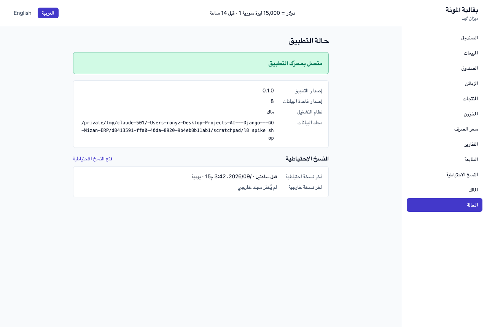
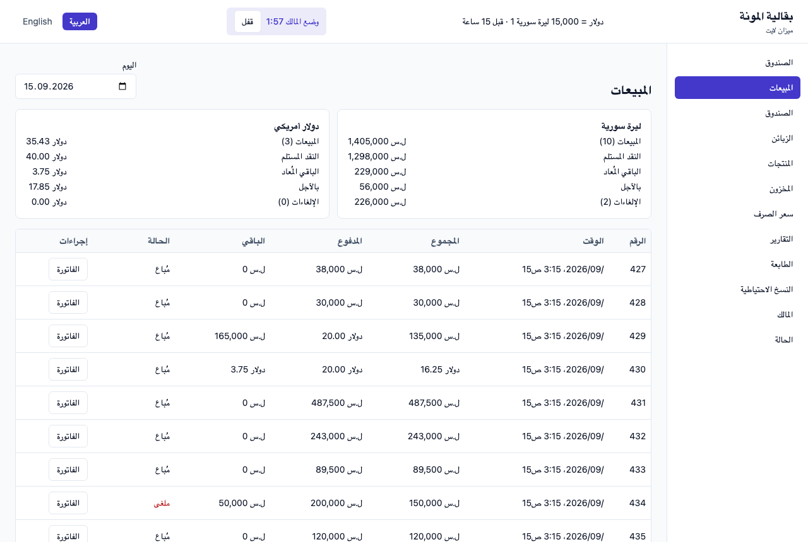
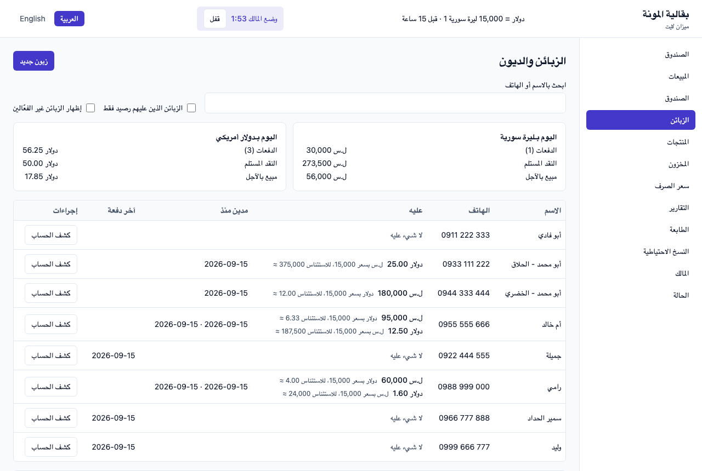
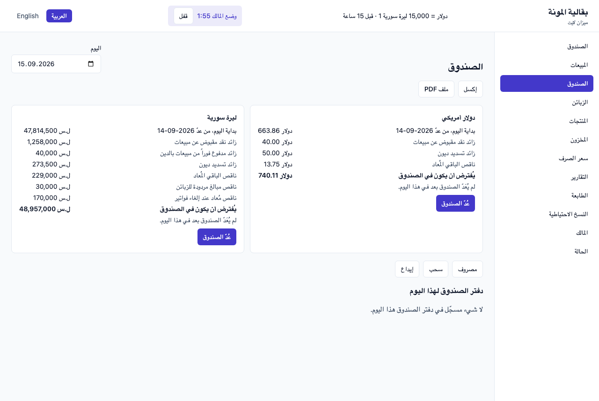
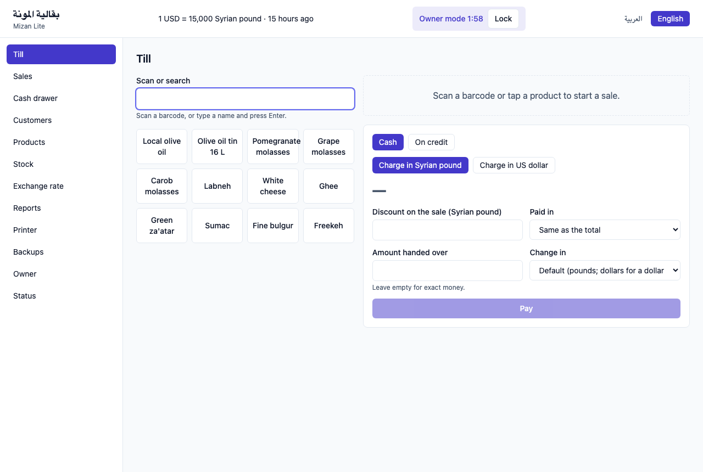
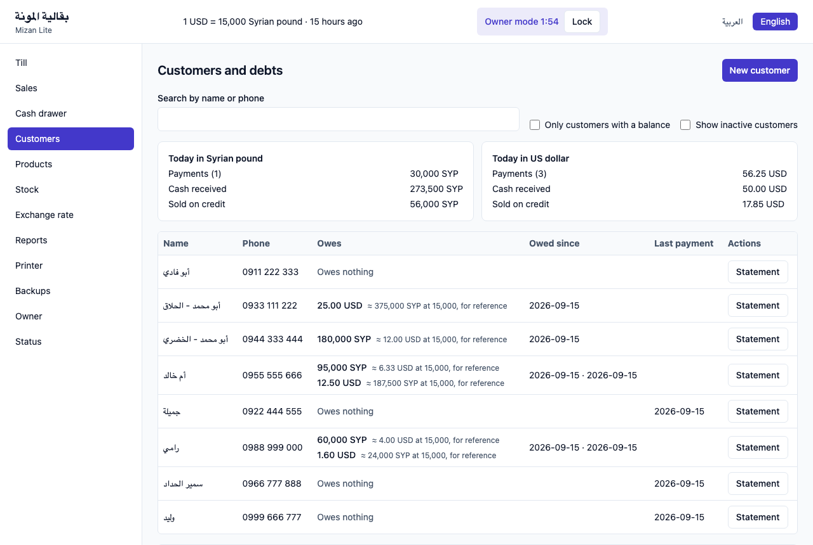

# Mizan Lite — Phase L8: end-to-end testing, polish, release and deployment (الاختبار الشامل والتحسين والإصدار)

> **Status: BUILT — 0.9.0 for the pilot.** The note, D-L8.1–20 and the owner's answers were approved on 2026-09-15; what was
> built, found and verified is recorded in §15–§22. Three checks remain with the owner: the Windows protocol (§7), a receipt on
> paper and an export in Excel (L7 O14), and the pilot week (§8).
> **Date:** 2026-09-15. **Base:** L7 (`d356598`). **Requirements:** the owner's of 2026-09-15 — the final integration and polish
> phase: **end-to-end testing**, **UI polish in Arabic and English**, **release packaging**, and **deployment documentation**.
> **Design:** [../DESIGN.md](../DESIGN.md) §10 (L8: installers, the seeder complete, a Definition of Done review in Mizan's form,
> one pilot shop for one week). Open items carried here: [../PROGRESS.md](../PROGRESS.md) O1, O3, O5, O6, O8, O9, O11, O14–O16.
> Mizan's own release procedure, reused where it fits: `docs/RELEASE.md`, `scripts/package-*.sh`, `scripts/fetch-webview2.sh`.

---

## 0. How to read this

| § | Content |
|---|---|
| 1 | Analysis — what "release" means for a shop that has no IT department, and **ten things harder than they look, three found by a spike before this note** |
| 2 | Scope — in, out, and amendments to DESIGN §10 |
| 3 | **End-to-end testing** — the real frontend against the real Go graph in a real browser; journeys; the packaged-app smoke; the upgrade matrix |
| 4 | **UI polish** — the defects the spike found, the systematic review, terminology, dates, keyboard, accessibility |
| 5 | **Release packaging** — artefacts, versions, the Windows installer, the macOS image, signing, licences |
| 6 | **Deployment documentation** — the shop's guide (Arabic first), the installer's guide, troubleshooting, the release procedure |
| 7 | The Windows verification protocol (O1) |
| 8 | The pilot shop week |
| 9 | Support and diagnostics — the About screen and the support file |
| 10 | Architecture — what is added, where, and the rules |
| 11 | **Verified before this note** — the spike, with its screenshots |
| 12 | Tests, drills, the Definition of Done review, the release gate |
| 13 | Risks |
| 14 | **Decisions and questions for approval** |

---

## 1. ANALYSIS

### 1.1 What L0–L7 prove, and what they do not

Every phase ended with `make lite-ci` green, its invariants drilled and its Go bindings tested; from L2 the packaged macOS app was
opened, and L4–L7 upgraded a real shop in it row for row. What no phase has done:

| Never done | Why it matters | Open item |
|---|---|---|
| **Run the frontend against the real Go graph and click through it** | Vitest tests every screen against a *fake* client; Go tests every binding without a screen. The seam between them — a DTO field the screen reads under another name, a refusal the screen does not expect — is covered only by the generated types | — |
| **Look at the screens** | screenshots of the webview were blocked here; 11 phases of screens have been reviewed in code only. **The spike (§11) looked at 17 and found eight defects in the first minute** | O5 |
| **Run on Windows** | every Windows path is compiled, none executed: Local AppData, the single-instance lock, WebView2, file release on close, the Save dialogs, the spooler and GDI printing | O1 |
| **Install from an installer** | there is no Lite installer yet; Mizan's exist and are reused (§5) | O3 |
| **Print on paper, open in Excel** | L7's two outstanding checks | O14 |
| **Run in a shop** | the pilot week (§8) | — |

### 1.2 Ten things harder than they look

**H1 — Windows is the product's most likely platform and the least proven one.** A pantry shop in Syria is far likelier to have a
Windows PC than a Mac. Nothing here can run a Windows binary (DESIGN §13.2 R1). **L8 cannot be released without a Windows run by the owner
(§7), and the note is designed around making that run short, scripted and recorded.**

**H2 — the screens can be tested for real without the Wails window. *Verified by spike (§11).*** A test-only HTTP server serves
the built frontend and answers `window.go.api.<Façade>.<Method>(…)` by calling the same `api.Set` the application binds, by
reflection; headless Chrome renders it. The production code does not change. This is Chromium, not WebKit (macOS) — but
**WebView2 on Windows *is* Chromium**, so on the owner's Windows machine the same journeys run in Edge against the engine the
shop will use.

**H3 — Arabic formatting defects exist that no test caught. *Found by the spike.*** Every date and time on screen in Arabic is
scrambled (`/2026/09، 3:15 ص15`): `Intl` inserts right-to-left marks and the Arabic `ص/م`, and the screen wraps the result in a
left-to-right isolate. The header's rate reads `دولار = 15,000 ليرة سورية 1`. Details in §4.1. They share one cause — a
figure-bearing *sentence* isolated as a figure — which L7 fixed on paper (D-L7.i5, D-L7.i6) but not on screen.

**H4 — an unsigned application is blocked by default on both systems.** macOS 15 no longer offers *Open* on right-click for an
unnotarized app; the owner must go to **System Settings → Privacy & Security → Open Anyway**. Windows SmartScreen shows
*Windows protected your PC*. Signing needs certificates tied to a legal identity and a payment (Mizan `RELEASE.md` §4) —
**the owner's decision (Q-L8.2)**; the build must not depend on it.

**H5 — WebView2 offline.** A Windows 10 PC without the runtime shows a blank window. Mizan's installer embeds Microsoft's
standalone runtime (213 MB, already fetched in this checkout) and installs it only when absent. Lite reuses the macro; the
*unplugged cable* test is the only proof (§7).

**H6 — upgrades between releases are where data is lost.** A shop installs 1.0.1 over 1.0.0 while the old one is still open; or
reinstalls an older version after an upgrade. The single-instance lock, the pre-migration backup and the migrator's version gate
(an older binary never writes through a newer schema) already exist; **no test installs over a running copy, and no test migrates
a database from every past schema to the release** (§3.6).

**H7 — performance on the shop's hardware.** Argon2id's PIN verification holds the single writer while it runs (O6); a
year's reports are fast here and unmeasured on a four-year-old Celeron (O8). A timing script the owner runs (§7) replaces
guessing.

**H8 — the pilot must be survivable.** A week in a real shop means real money on day one. The paper book runs beside the
application for the first days, an outside backup is taken every evening, and a defined exit decides 1.0.0 (§8).

**H9 — three readers, three documents.** The shopkeeper (Arabic, no technical vocabulary, reads in a hurry), the person who
installs (a relative or technician, Windows, printers, USB drives), and whoever cuts the next release. One document for all three
serves none (§6).

**H10 — licences travel with the binary.** The embedded IBM Plex Sans Arabic is OFL: its licence must accompany every copy.
go-text, x/image, modernc SQLite, Wails and React carry BSD/MIT notices. Today none is shown or shipped (§5.7, §9).

---

## 2. SCOPE

### 2.1 In L8

| Area | What |
|---|---|
| **E2E** | the test-only bridge; ten journeys in both languages in a real browser; a visual pack of every screen and dialog; browser-side structural checks; the packaged-app smoke on macOS (and the same script for Windows); the upgrade matrix across every past schema |
| **Polish** | the spike's eight defects fixed with a test each; a systematic review of every screen in both languages against a checklist; a terminology glossary; Arabic date and number rules; keyboard use at the till; accessible names, contrast, no physical-direction CSS |
| **Seeder complete** | the seeder exercises L7: printer settings, a voucher, a reprint, an outside backup folder, a backup |
| **Packaging** | Windows NSIS installer with offline WebView2; macOS universal DMG; opt-in signing and notarization hooks; one version source; release notes; checksums; third-party notices |
| **Support** | an About screen (version, schema, data folder, licences); a support file (logs and diagnostics; the database only if chosen) |
| **Documentation** | the shop's guide in Arabic and English; the installation guide; printer setup; backup and moving to a new computer; troubleshooting; the release procedure; the Windows protocol; the pilot protocol |
| **Closing** | the Windows verification run (O1, O3, O6), the printer and Excel checks (O14), the Definition of Done review over L0–L8, the pilot week |

### 2.2 Not in L8

Automatic updates (the shop is offline; a new installer is run over the old one); multi-user accounts; cloud or network sync;
a mobile app; new business features — except the one the pilot may need, Q-L8.9 (importing products from a spreadsheet).

### 2.3 Amendments

| # | Amends | To |
|---|---|---|
| A-L8.1 | DESIGN §10 L8 "installers, seeder complete, DoD review, pilot" | adds end-to-end testing, UI polish, the support file and the documentation set (the owner, 2026-09-15) |
| A-L8.2 | DESIGN §10 "the packaged app was opened and the screens looked at" (every phase) | for L0–L7 closed retroactively by the visual pack (§3.4) and the owner's review, both languages |
| A-L8.3 | the landing route `/` = the Status screen (L0) | the counter lands on the Till; Status moves under About (Q-L8.5) |

---

## 3. END-TO-END TESTING

### 3.1 The test pyramid as it stands, and the missing layer

| Layer | Exists | Proves |
|---|---|---|
| Domain and store tests (Go) | since L0 | invariants, refusals, SQL |
| Binding tests (Go) | since L0 | each façade through the real graph |
| Screen tests (Vitest, fake client) | since L0 | each screen's behaviour against the generated types |
| Seeder | since L1 | a month of a shop through the services, verifiers after |
| Packaged app opened | L4–L7, macOS | migration and boot on real data |
| **Real screen ↔ real Go, clicked through** | **no** | **L8 adds it** |

### 3.2 The bridge (D-L8.1) — *verified by spike*

`internal/lite/e2e` (test code only) starts the graph on a data directory, attaches an `api.Set`, and serves:

- `GET /` — the **built** `frontend/dist/index.html`, with the stored locale written into `<html lang dir>` (as `apps/lite`'s
  middleware does) and a 12-line script that defines `window.go.api` as a proxy: every call becomes
  `POST /call {façade, method, args}`;
- `POST /call` — looks the method up on `Set.Bindings()` by name, decodes each argument into the method's parameter type, calls it,
  returns the envelope as JSON — exactly the value Wails would return;
- the stand-ins every binding test already uses: a Save dialog answering a path under the test directory, a printer recording its
  jobs, a restarter.

It listens on `127.0.0.1` only, is compiled only into tests (a `_test.go` harness plus a `cmd/lite-e2e` behind the `e2e` build tag),
and an archlint rule forbids `apps/lite` from importing it. **The shipped application is unchanged.**

### 3.3 The browser (D-L8.2)

| Option | Offline | New dependency | Interaction | Engine on Windows |
|---|---|---|---|---|
| Headless Chrome `--screenshot` (the spike) | yes | none | **none** — screenshots only | Edge |
| `chromedp` (Go) | yes | a Go module in Mizan's graph | yes | Edge (with care) |
| `@playwright/test` with its browsers | after a ~300 MB download | npm + browsers | yes | bundled Chromium, not Edge |
| **`playwright-core` with the installed browser** | **yes, once the npm package is cached** | **one npm dev dependency, no browser download** | **yes** | **Edge via `channel: "msedge"` — the WebView2 engine** |

*Recommended: `playwright-core`* driving the Chrome already installed on the Mac and the Edge every Windows PC has (Q-L8.13). When
neither is present the run is reported **NOT RUN**, never passed.

### 3.4 Journeys and the visual pack (D-L8.3, D-L8.4)

Each journey starts from an empty data directory or the seeded month, drives the screen as a person would — keyboard and clicks,
never by calling Go directly — and **afterwards asserts the Go state through the bindings** (a sale recorded, a row in
`print_jobs`, a file written). Each runs in Arabic and in English.

| # | Journey | Ends by asserting |
|---|---|---|
| J1 | First run: shop name, language, PIN twice, the recovery code shown, the rate | settings, owner credential, the rate in force |
| J2 | A product, loose and packaged; opening stock with a cost; a delivery | stock levels, average cost |
| J3 | **A cash sale by keyboard only**: scan, quantity, pay in pounds with a dollar note, change, receipt, *Print* | the sale, its rounding and change; a print job; the receipt copy stamp on reprint |
| J4 | A credit sale to a new customer; the receipt prints itself; a repayment in the other currency; its voucher | debt entries, balance, voucher number |
| J5 | A void with the owner's PIN: *Hand back* stated before the PIN | the void; the drawer's void return |
| J6 | The drawer: a count with a difference; an expense with the PIN | cash entries; the difference |
| J7 | Reports with the PIN: Day, Month, Products, Stock; owner mode ends and the figures leave the screen | nothing written; the refusal after the countdown |
| J8 | Exports: every report and the ledger to Excel and PDF | the files exist, parse, and carry the screen's figures |
| J9 | Backups: *Back up now*, an outside folder, a restore with its loss sentence and PIN, the restart | the restored data; the safety snapshot listed first; Home's notice |
| J10 | The rate: manual change with the large-change confirmation; switching language mid-session | the rate history; the direction flips without a reload artefact |

**The visual pack:** the same harness captures every route and every dialog — about 45 views — in both languages, at **1366×768**
(the commonest shop laptop) and **1024×768**, into `build/lite-e2e/screens/`. It is **looked at by a person** at every release
(§12.3); it is not compared pixel by pixel, because fonts differ per system and a pixel golden that fails on every font update
teaches people to regenerate goldens.

**Structural checks run in the browser on every view** (D-L8.4): no horizontal page overflow; no text clipped by its box
(`scrollWidth > clientWidth` on a text element); every control has an accessible name; no two navigation items share a label; in
Arabic, no visible Latin-only label except the allow-listed (`PDF`, `USB`, `ESC/POS`, product names); every date and money figure
comes from a formatter (a `data-figure` attribute the formatters set).

### 3.5 The packaged-app smoke (D-L8.5)

`scripts/lite-smoke-macos.sh` does what L4–L7 did by hand: copy a fixture shop, launch the built `.app` with
`MIZAN_LITE_DATA_DIR`, wait for `health requested by the frontend` in the log, quit with `SIGTERM`, then check the log has no
`ERROR`, integrity is `ok`, the schema is the release's, and an `on_close` backup exists when due. `scripts/lite-smoke-windows.ps1`
is the same for the owner's machine (§7). The smoke runs on the **installed** application, not the build folder.

### 3.6 The upgrade matrix (D-L8.6)

A shop can skip releases. For each schema version a shop has ever had — 1 (L0) through 8 (L7) — a small fixture database is
generated **once** by checking out that phase's commit and running its own seeder (deterministic, `-seed 42`), and committed under
`internal/lite/bootstrap/testdata/schemas/` (each ≤ 2 MB). `TestEveryPastSchemaUpgradesToThisRelease` opens each through the real
migrator and asserts: every pre-existing row identical, every verifier clean, the reports' reconciliations holding, a sale
possible afterwards. `TestAnOlderBinaryRefusesANewerDatabase` holds the version gate for the release.

### 3.7 What end-to-end testing still cannot prove

WKWebView-specific rendering on macOS (the packaged app is looked at by the owner); the printer's own behaviour (O14); a Windows
profile's permissions (§7); a shop's real hours (§8).

---

## 4. UI POLISH

### 4.1 Defects found by the spike (to fix, each with a test)

| # | Where | Seen | Cause | Fix |
|---|---|---|---|---|
| S1 | **Every Arabic date and time** — Sales, Backups, the statement, the receipt, Rates, Cash | `/2026/09، 3:15 ص15` | `Intl` output (RLM marks, `ص/م`) wrapped in `<bdi dir="ltr">` | dates as figures only: `2026-09-15 15:15`-style Latin digits in a left-to-right isolate, the words outside it (Q-L8.6) |
| S2 | The header's rate (Arabic) | `دولار = 15,000 ليرة سورية 1` | a whole sentence isolated left to right | isolate only the figures; the template carries the words (as `doc.rate`, D-L7.i6) |
| S3 | The reference beside a balance (Customers, Arabic) | `≈ ل.س بسعر 15,000، للاستئناس 375,000` | the same | the same |
| S4 | Navigation (Arabic) | **الصندوق** twice — the Till and the Cash drawer | two keys translated alike | distinct names (Q-L8.5); a gate: labels unique per language |
| S5 | The Cash drawer's first term (Arabic) | `من عدّ 14-09-2026` — the date reversed inside the sentence | a date not isolated in a sentence | isolate it as a figure |
| S6 | The Till's *Change in* select | `الافتراضي (ليرة: ويدولار لبيع بالدولار مدفوع بالد…` cut off | a sentence as an option label | a short label and a hint beneath |
| S7 | The header's rate (English) | `1 USD = 15,000 Syrian pound` | singular name for a plural | the short code (`SYP`) or a plural form |
| S8 | Landing on `/` | a technical status page (version, schema, data folder path) is the first screen a cashier sees | L0's proof screen never replaced | land on the Till; Status under About (A-L8.3) |

Enlarged:  

 

The English screens rendered cleanly in the same run:  

### 4.2 The systematic review (D-L8.7)

Every view of the visual pack, both languages, against one checklist, recorded in this note with the defects found and closed:

1. **Words** — every string read by a native Arabic reader (the owner, Q-L8.14) for register and clarity; errors say what to do;
   no internal words (*seq*, *façade*, *envelope*) on screen. The English read for the same.
2. **Figures** — the rules of §4.3; money always with its currency; no figure in an Arabic sentence without isolation.
3. **Layout** — no overflow or clipping at 1024×768; dialogs fit; tables scroll inside themselves; long names wrap, never overlap.
4. **States** — empty, loading, error and refusal shown for every list and act; nothing silently empty.
5. **Keyboard** — the till usable without a mouse (§4.4); every dialog closes with Escape and returns focus; focus visible.
6. **Accessibility** — accessible names; colour never the only signal (a voided sale says *ملغاة*, not only red); contrast ≥ 4.5:1
   for text (checked in the browser).
7. **Consistency** — one term for one thing (§4.3), buttons in the same order in every dialog (*Cancel* then the act, in reading
   order), the owner's acts always marked.

### 4.3 Terminology, dates and numbers (D-L8.8)

A **glossary** (`docs/mizan_lite/GLOSSARY.md`) — each concept, its Arabic and English term, where it appears — is the reference for
the review and the guide: till / نقطة البيع, cash drawer / الصندوق, receipt / فاتورة, voucher / سند, void / إلغاء, credit sale /
بيع بالآجل, payment / دفعة, write-off / إعفاء, owner mode / وضع المالك, backup / نسخة احتياطية, outside folder / المجلد الخارجي …
(the Till's Arabic name is Q-L8.5).

**Dates and times (Q-L8.6):** Latin digits (DESIGN Q6); day, month, year in the order the shop reads (`15/09/2026` recommended);
times as `15:15` (24-hour) or `3:15 م` with the marker **outside** the isolate. Month names, where a month is written out, in the
Levantine form (أيلول, not سبتمبر) — the form a Syrian shop uses. **Numbers:** Latin digits, `,` grouping, `.` decimals, the
currency after the figure (as today on screen and on paper).

### 4.4 Keyboard at the counter (D-L8.9)

The scan field holds focus (L4). Added: `Enter` on an empty scan field opens *Pay* when the cart has lines; `F2` quantity of the last
line, `F4` credit, `F9` pay, `Esc` closes the receipt and returns to the scan field; `+`/`-` on the last line. Shown in a small
legend on the Till, in both languages, and tested in J3.

---

## 5. RELEASE PACKAGING

### 5.1 Artefacts

| Artefact | Built by | Notes |
|---|---|---|
| `Mizan Lite <version>.dmg` | `make lite-package-macos` | universal (arm64 + x86_64), drag to Applications, `hdiutil` only |
| `Mizan Lite <version> Setup.exe` | `make lite-package-windows` | NSIS; embeds the WebView2 standalone runtime (~220 MB); Arabic and English installer UI (Q-L8.7) |
| `SHA256SUMS.txt` | `make lite-release` | verified with `shasum -a 256 -c` |
| `RELEASE_NOTES.<version>.md` (ar, en) | written per release | what changed, what to check after installing |

No bare portable `.exe` (Mizan ships one): a Lite installation always has its WebView2 checked and its shortcuts made.

### 5.2 Versions (D-L8.10)

One source: `apps/lite/wails.json` `productVersion`. Tags `lite-v<version>`; a build on the tag is the version, anything else is
`<version>-dev.<sha>` and says so in the About screen, the log's first line and every backup's manifest (closing Mizan finding M4
for Lite). **The pilot is `0.9.0`; `1.0.0` is tagged at the pilot's exit (Q-L8.10).** Schema versions are unrelated to product
versions and are listed in the release notes.

### 5.3 The Windows installer (D-L8.11)

`apps/lite/build/windows/installer/project.nsi`, derived from Mizan's, with:

- **per-machine install** under `Program Files\Mizan Lite` (admin once, at install) so WebView2 is installed machine-wide
  (Q-L8.7); Start-menu and desktop shortcuts named **ميزان لايت** / *Mizan Lite* by installer language;
- the offline WebView2 macro (checks the machine and user keys, installs silently only when absent);
- **refuses to proceed while Mizan Lite is running** (checked before copying — how, against Wails' single-instance lock, is verified on Windows in §7 step 12);
- installs over an older version in place; **never touches `%LOCALAPPDATA%\Mizan Lite`**; the uninstaller says the shop's data
  is kept and where;
- `scripts/lite-package-windows.sh` refuses to build without the 200 MB runtime (Mizan's size check).

### 5.4 The macOS image (D-L8.12)

`scripts/lite-package-macos.sh`, derived from Mizan's: the `.app` and an `/Applications` link in a UDZO image; the image's window
shows a background with an arrow and one line in Arabic and English (*اسحب ميزان لايت إلى التطبيقات*). `LSMinimumSystemVersion`
13.0 is already declared.

### 5.5 Signing (D-L8.13, Q-L8.2)

Opt-in hooks exactly as Mizan's: `MIZAN_LITE_MACOS_IDENTITY` signs with the hardened runtime and prints the `notarytool` and
`stapler` commands; Windows `signtool` is a separate step on a machine holding the certificate. **A build never needs a
certificate** (`TestSigningIsOptIn`). Unsigned releases are documented with the exact bypass for macOS 15 and Windows 11, with
screenshots, in the installation guide.

### 5.6 One command (D-L8.14)

`make lite-release` on a clean tag: `lite-ci` → e2e journeys → upgrade matrix → both builds → both packages → the macOS smoke on the
packaged app → checksums → a manifest listing every artefact, its size, the commit and what was NOT RUN. It stops at the first
failure.

### 5.7 Licences (D-L8.15)

`scripts/lite-notices.sh` writes `THIRD_PARTY_NOTICES.txt` from the licence files of every Go module in Lite's import graph (read
from the local module cache — no network) and every npm package in the production bundle, plus the OFL for IBM Plex Sans Arabic.
It ships inside both packages and is shown in About. A test fails if a module in the graph has no licence file.

---

## 6. DEPLOYMENT DOCUMENTATION

### 6.1 The set (D-L8.16)

A new folder `docs/mizan_lite/guide/`, indexed by the docs gate. **Arabic is written first; English follows with the same
sections** — a gate holds the two to the same headings.

| Document | Reader | Content |
|---|---|---|
| `SHOP_GUIDE.ar.md` / `SHOP_GUIDE.md` — *دليل المحل* | the shopkeeper | the first day (PIN and the recovery code — write it down), the rate each morning, selling (cash, dollars, credit, discounts), voids, the drawer and its count, customers and payments, products and deliveries, reports, printing and exports, backups, what to do when… Screenshots from the visual pack, Arabic |
| `QUICK_CARD.ar.md` | the counter | one A4 page to print and keep beside the till: the keys, the daily routine, who to call |
| `INSTALL.ar.md` / `INSTALL.md` | the installer | requirements (Windows 10/11 64-bit or macOS 13+, 4 GB RAM, 1366×768), installing offline, the unsigned warning and its bypass, first run, the printer (§6.2), the outside backup folder, installing a new version, uninstalling, **moving the shop to a new computer** |
| `PRINTERS.md` | the installer | installing an 80 mm printer on Windows and macOS, choosing driver or ESC/POS, the test page, the drawer, known models tested (filled from O14 and the pilot) |
| `TROUBLESHOOTING.ar.md` / `TROUBLESHOOTING.md` | both | a blank window (WebView2), *already running*, a forgotten PIN (the recovery code), a lost recovery code (what cannot be recovered, and why), the rate stale, the printer not printing, the outside folder missing, restoring after a disk failure, where the data and logs are, making a support file |
| `RELEASE.md` (in `docs/mizan_lite/`) | whoever releases | versioning, `make lite-release`, signing, the manual checks, publishing checksums, the release notes template |
| `WINDOWS_PROTOCOL.md`, `PILOT.md` (in `phases/`) | the owner and the developer | §7 and §8 as checklists, with a results table filled in |

### 6.2 Shipping the guide with the application

The Arabic and English shop guides and the quick card are rendered to **A4 PDF by Lite's own document renderer** (L7's
`documents` package, the same font and bidi rules) and installed beside the application; About opens them. No browser, no internet,
and the guide prints on the shop's printer.

---

## 7. THE WINDOWS VERIFICATION PROTOCOL (O1, O3, O6)

Run once on the owner's Windows PC (Q-L8.1), ideally the pilot shop's own, **with the network cable unplugged from step 2**. Each
step has its expected result; the results table is filled in and committed.

1. Copy `Setup.exe` from a USB drive. Note the Windows edition, RAM, CPU and screen size.
2. Install. Record the SmartScreen warning (unsigned) and the bypass. Confirm WebView2 was installed or found.
3. Launch. First run in Arabic: the window is not blank; Arabic renders joined; direction right to left.
4. `scripts\lite-smoke-windows.ps1` confirms the data under `%LOCALAPPDATA%\Mizan Lite`, logs, the first backup.
5. Launch a second copy: it focuses the first (single-instance).
6. Sell (J3 by hand). Print a test page and a receipt on the shop printer, driver path then ESC/POS (O14).
7. Export a report to Excel through the Save dialog to the Desktop and to a USB drive; open it in Excel (O14).
8. Choose the USB drive as the outside folder; *Back up now*; pull the drive; confirm Home's warning; restore the newest backup.
9. Close, reopen: the `on_close` backup; the restore notice.
10. `scripts\lite-timing.ps1`: PIN verification time (O6), a month's report and a year of sales history on a generated shop (O8).
11. With the network reconnected, the e2e journeys in Edge (§3.3) — WebView2's engine on this machine.
12. Install the next build over this one while it is running: the installer refuses; close; install; data intact.
13. Uninstall: the application gone, `%LOCALAPPDATA%\Mizan Lite` kept.

**A failure in steps 2–9 blocks the release.** Step 10's figures set Q-L8.12's minimum hardware.

---

## 8. THE PILOT SHOP WEEK

**Entry:** L8's release gate green (§12.4) on `0.9.0`; the Windows protocol passed on the pilot machine; printer and Excel checked;
the owner has read the shop guide; the shop's products entered (or imported, Q-L8.9) and opening stock counted; the paper book's
debts adopted (L5); an outside folder chosen.

**Every day:** the rate set in the morning; sales through the application; **the paper book kept in parallel for the first three
days** (Q-L8.4); the drawer counted at closing; the outside backup taken; a one-line log in `PILOT.md` (sales count, difference at
count, anything odd). Every evening a support file (without the database) to the developer by USB or message, if the owner agrees.

**Issues:** a *stop* issue (money wrong, data lost, the till unusable) — the shop returns to paper, the backup is kept, a fix
release follows; anything else is written down and fixed after the week.

**Exit (all):** seven trading days; no stop issue open; every day's verifiers clean (sales, stock, debts); the drawer's count
differences explained; the first three days' paper book and application agree; the owner's acceptance. Then **`1.0.0`** is tagged
from the same commit plus fixes, the gate re-run.

---

## 9. SUPPORT AND DIAGNOSTICS

### 9.1 About (D-L8.17)

Replaces the Status screen's content (A-L8.3): product version and commit, schema version, the operating system, the data folder with
*Show in folder*, the log folder, the shop guide and quick card (§6.2), the licences (§5.7). Reachable from the owner's area and
from the first-run screen.

### 9.2 The support file (D-L8.18, Q-L8.8)

*Save a support file…* writes a zip through the Save dialog: the last 7 days of logs, versions, OS, screen size, locale and time
zone, the verifiers' findings, the settings **without** the PIN hash, the backup list and status, the last 50 print jobs. **The
database is included only when the owner ticks it**, with a sentence saying it holds customers' names and debts. Nothing is sent
anywhere by the application. A test holds the zip free of the PIN, its hash and the recovery code — the logs are read for them too, because no test has held the logs to that before.

---

## 10. ARCHITECTURE

| Addition | Where | Rule |
|---|---|---|
| E2E bridge | `internal/lite/e2e` (+ `cmd/lite-e2e`, build tag `e2e`) | `lite-e2e-test-only`: nothing under `apps/lite` or any module imports it; it imports only `api`, `bootstrap`, `paths` and test fakes |
| Journeys and structural checks | `apps/lite/frontend/e2e/` (TypeScript, `playwright-core`) | not part of the production bundle — the G5 bundle gate extended to assert it |
| Upgrade fixtures | `internal/lite/bootstrap/testdata/schemas/` | generated by `scripts/lite-schema-fixtures.sh`, committed |
| Support file | `internal/lite/support` (pure: collects through ports, writes a zip) | `lite-support-isolated`; no database access except through ports |
| About, support bindings | `App.About`, `App.SaveSupportFile`, `App.OpenGuide` | 3 new, 93 in all |
| Packaging | `apps/lite/build/windows/installer/`, `scripts/lite-package-*.sh`, `scripts/lite-notices.sh`, `scripts/lite-smoke-*.{sh,ps1}`, `scripts/lite-timing.ps1` | `buildconfig_test.go` extended: versions agree, the installer checks the mutex and WebView2, never deletes the data folder |
| Guides | `docs/mizan_lite/guide/` | the docs gate: indexed, links resolve, Arabic/English heading parity |
| No schema change | — | — |

---

## 11. VERIFIED BEFORE THIS NOTE

1. **The bridge (H2).** A short test file in `apps/lite` served the built `frontend/dist` with a `window.go.api` proxy and dispatched calls by
   reflection to an `api.Set` attached to a copy of the seeded L7 shop (schema 8). **Headless Chrome 153** (`--headless=new
   --screenshot`) rendered 11 routes in Arabic and 6 in English, with owner mode entered through the same bridge, a few seconds
   each. Every screen reached Go: the header's rate, the owner countdown, the day's sales, the drawer, backups. The file was
   deleted after the spike.
2. **What it found:** S1–S8 (§4.1), none caught by 471 frontend tests, because Vitest's jsdom does not lay out bidirectional text.
3. **`--virtual-time-budget` never returns** on this application (the owner countdown and rate age keep timers alive); a wall-clock
   timeout does. Interaction (clicks, typing) needs a driver — §3.3.
4. **The toolchain here:** Go 1.27.1, Wails 2.13.0, `makensis` (Homebrew), `hdiutil`, `codesign` with **no signing identity**,
   Google Chrome 153; the WebView2 standalone runtime (213 MB) already fetched under `build/windows/webview2/` by Mizan's script.
5. **The application's identity:** `com.mizanerp.lite`, `LSMinimumSystemVersion` 13.0, a single-instance lock keyed by the bundle id,
   data under Local AppData on Windows (L0).
6. **The seeder does not exercise L7** (no printer settings, vouchers or outside backups) — "the seeder complete" is real work.
7. **Mizan's release procedure** (`docs/RELEASE.md`) — its macOS finding stands for Lite: an ad-hoc signature is rejected by
   Gatekeeper; only Developer ID plus notarization is accepted.

---

## 12. TESTS, DRILLS, DEFINITION OF DONE

### 12.1 Tests (names are the contract)

| Layer | Tests |
|---|---|
| **e2e harness** | `TestTheBridgeCallsEveryBoundMethod` (every generated function reachable, arguments decoded, envelopes identical to a direct call) · `TestTheBridgeListensOnLoopbackOnly` |
| **journeys** | J1–J10 × Arabic, English (§3.4) · the structural checks on every view |
| **upgrade** | `TestEveryPastSchemaUpgradesToThisRelease` · `TestAnOlderBinaryRefusesANewerDatabase` |
| **polish** | `formatDateTime` and every figure formatter in Arabic produce no bidi mark inside an isolate · the header rate, reference and drawer terms in both languages · `TestNavigationLabelsAreUniquePerLanguage` · the till keys |
| **support** | `TestTheSupportFileHoldsNoSecret` · `TestTheDatabaseIsOnlyIncludedWhenChosen` |
| **packaging** | `TestVersionsAgree` (wails.json, Info.plist, installer, About) · `TestTheInstallerKeepsTheShopsData` · `TestTheInstallerRefusesWhileRunning` · `TestSigningIsOptIn` · `TestEveryModuleHasALicence` |
| **docs** | `TestTheGuidesHaveTheSameSectionsInBothLanguages` |
| **seeder** | the seeded month includes printer settings, a printed receipt and reprint, a voucher, an outside backup; verifiers after |

### 12.2 Drills planned

At least: the bridge answering a method the application does not bind; a journey passing with its final Go assertion removed;
a date formatter reintroducing a bidi mark; two navigation labels made equal; an installer script deleting the data folder; an
installer not checking the running mutex; a version drifting between wails.json and the installer; a module without a licence
file; the support file including the PIN hash; the database included unticked; an Arabic guide section missing in English; the
e2e package imported by `apps/lite` (archlint).

### 12.3 The Definition of Done review (DESIGN §10, Mizan's form)

A document, `phases/L8_DOD_REVIEW.md`, walks **every criterion of L0–L8** — DESIGN §10's table, the four lines every phase carries,
each phase's §12.3 — and records for each: ✅ with named evidence (a test, a file, a command, a screenshot), or ❌ and what was done.
Criteria are not reworded to pass. Open items O1–O16 are each closed, accepted by the owner with a reason, or carried into a named
later release.

### 12.4 The release gate (for `0.9.0`, and again for `1.0.0`)

> `make lite-release` green — lite-ci, e2e journeys in both languages, the upgrade matrix, both packages, the macOS smoke — nothing
> NOT RUN except what is listed · the visual pack looked at in both languages, S1–S8 closed · the Windows protocol passed (§7) · a
> receipt printed and an export opened in Excel (O14) · the guides written and read by the owner · the DoD review complete ·
> Mizan's `scripts/check.sh` green · for `1.0.0`: the pilot's exit criteria met (§8).

---

## 13. RISKS

| Risk | Likelihood | Effect | Mitigation |
|---|---|---|---|
| No Windows machine before release | medium | release blocked (H1) | Q-L8.1 asked first; a borrowed PC or a Windows 11 VM on another computer is enough for §7 steps 1–9 and 11–13 |
| WebView2 renders Arabic or dialogs differently from Chrome | low | polish defects on the shop's PC | Edge journeys on the Windows machine (§7 step 11) |
| Unsigned installers frighten the shop | high | installation abandoned | the guide's screenshots of the bypass; the installer person present; Q-L8.2 |
| A Windows-only defect in printing or dialogs | medium | O14 fails on Windows | §7 steps 6–7 before the pilot; ESC/POS as the fallback path |
| The pilot finds a money defect | low | a week restarts | paper book in parallel for three days; daily verifiers; stop criteria |
| Low-end PC too slow at the PIN or reports | medium | the counter waits | §7 step 10 measures; the hasher is injected (`Options.PINHasher`), so its cost can be tuned with evidence — a decision for after the measurement |
| `playwright-core` unavailable offline on a fresh checkout | low | e2e NOT RUN | npm cache as for every other dependency; NOT RUN is reported |

---

## 14. DECISIONS AND QUESTIONS FOR APPROVAL

### 14.1 Decisions — approve, amend, or reject

| # | Decision | § |
|---|---|---|
| D-L8.1 | End-to-end tests drive the real built frontend against the real Go graph through a test-only loopback bridge; the shipped application does not change | 3.2 |
| D-L8.2 | The browser is driven by `playwright-core` using the installed Chrome (macOS) or Edge (Windows); absent browser = NOT RUN | 3.3 |
| D-L8.3 | Ten journeys (J1–J10) in both languages, each ending with assertions on Go state | 3.4 |
| D-L8.4 | A visual pack of every view in both languages at 1366×768 and 1024×768, looked at by a person each release; structural checks automated; no pixel goldens for screens | 3.4 |
| D-L8.5 | A packaged-app smoke script on macOS, and its PowerShell twin for Windows, run on the installed application | 3.5 |
| D-L8.6 | Fixture databases for every past schema (1–8), generated once by each phase's own seeder, committed; each upgraded and verified on every run | 3.6 |
| D-L8.7 | A systematic review of every view against a seven-point checklist, recorded with the defects found; S1–S8 fixed with a test each | 4.1, 4.2 |
| D-L8.8 | A glossary of terms in both languages; dates and numbers by one rule on screen, on paper and in the guide | 4.3 |
| D-L8.9 | The till fully usable by keyboard, with a visible key legend | 4.4 |
| D-L8.10 | One version source (`wails.json`), tags `lite-v…`, `-dev.<sha>` otherwise; the version in About, the log and backup manifests | 5.2 |
| D-L8.11 | A per-machine NSIS installer embedding offline WebView2, refusing while Lite runs, never touching the shop's data | 5.3 |
| D-L8.12 | A universal DMG built with `hdiutil`, bilingual instruction in the image | 5.4 |
| D-L8.13 | Signing and notarization opt-in; a build never needs a certificate; unsigned bypasses documented with screenshots | 5.5 |
| D-L8.14 | `make lite-release` builds, tests, packages and smoke-tests a release from a clean tag and lists what was NOT RUN | 5.6 |
| D-L8.15 | Third-party notices generated offline from the module cache and the bundle, shipped and shown; the OFL with the font | 5.7 |
| D-L8.16 | A documentation set in `docs/mizan_lite/guide/`, Arabic first with English parity held by a gate; the shop guide rendered to PDF by Lite and installed | 6 |
| D-L8.17 | An About screen replaces Status as the technical view; the counter lands on the Till | 9.1, A-L8.3 |
| D-L8.18 | A support file written only where the owner saves it; the database only when chosen; no secret in it; nothing sent by the application | 9.2 |
| D-L8.19 | The Windows verification protocol and the pilot week are release criteria with recorded results; 0.9.0 for the pilot, 1.0.0 at its exit | 7, 8 |
| D-L8.20 | A Definition of Done review over L0–L8 in Mizan's form; criteria never reworded to pass | 12.3 |

### 14.2 Questions only you can answer

**Q-L8.1 — Can you provide a Windows PC (or a Windows 10/11 virtual machine) before the release, ideally the pilot shop's own?**
*Recommended: yes — required.* Nothing here can run Windows (H1); the release gate needs §7 on real Windows.

**Q-L8.2 — Code signing: buy the certificates, or release unsigned?** Apple Developer ID with notarization (~$99/year) and a
Windows certificate (OV ~$200–400/year, which still warns until reputation builds; EV more, clears SmartScreen at once), both in
the legal name of whoever ships Lite. *Recommended: the pilot unsigned, with the bypass documented and the installer person
present; decide on certificates before any wider distribution.*

**Q-L8.3 — Who installs Lite in a shop — you, a technician, or the shopkeeper from a USB drive?** It decides how much the install
guide assumes. *Recommended: write for a relative or technician comfortable with Windows but not with software development.*

**Q-L8.4 — The pilot shop:** which shop, its computer and printer, when, and whether the paper book runs beside the application.
*Recommended: a shop that already sells on credit in both currencies, on its own Windows PC, paper book in parallel for the first
three days.*

**Q-L8.5 — Navigation names and the first screen.** The Till and the Cash drawer are both *الصندوق* today (S4). *Recommended: the
Till **نقطة البيع** (or **البيع**), the Cash drawer **الصندوق**; the counter lands on the Till; Status becomes *About* under the
owner's area.*

**Q-L8.6 — How should dates look in Arabic?** `15/09/2026`, `2026-09-15`, or `15 أيلول 2026`; times `15:15` or `3:15 م`; month
names أيلول (Levantine) or سبتمبر. *Recommended: `15/09/2026` and `3:15 م` in lists; `15 أيلول 2026` where a date is written out
(reports' titles, the guide).*

**Q-L8.7 — The Windows installer: per-machine (asks for administrator once, installs WebView2 for everyone) or per-user (no
administrator)?** And its language. *Recommended: per-machine; the installer in Arabic with English available.*

**Q-L8.8 — May the support file include a copy of the database when the owner ticks it?** It holds customers' names, phones and
debts. *Recommended: yes, unticked by default, with the warning sentence.*

**Q-L8.9 — Importing products from a spreadsheet** (name, barcode, unit, price, currency, cost, opening quantity) to set up a real
shop of hundreds of products. *Recommended: in L8 if the pilot shop has more than ~150 products — typing them is a day's work and a
source of mistakes; otherwise after 1.0.0.*

**Q-L8.10 — Version numbers:** *Recommended: `0.9.0` for the pilot, `1.0.0` at its exit.*

**Q-L8.11 — Updates:** confirm there is **no automatic update** — a new installer is run over the old one, from a USB drive if need
be. *Recommended: confirm.*

**Q-L8.12 — The minimum computer to support:** *Recommended:* Windows 10 22H2 or 11, 64-bit, 4 GB RAM, 1366×768; macOS 13 or later;
revised by §7's measurements.

**Q-L8.13 — May the frontend gain one development dependency, `playwright-core`** (no browser download; uses the installed Chrome or
Edge), for the end-to-end tests? *Recommended: yes.* The alternative, `chromedp`, adds a Go module to Mizan's graph.

**Q-L8.14 — Who reads the Arabic of every screen and the guide for register and clarity?** *Recommended: you, on the visual pack,
before the pilot — a native reader in the trade is the only reviewer who can say a word is wrong for a Syrian counter.*

---

## 15. AT APPROVAL (2026-09-15)

The owner approved this note and D-L8.1–20, and answered:

| Q | The owner's answer | In the build |
|---|---|---|
| Q-L8.1 | **Cross-compile the Windows executable from macOS; I will run and verify it on a Windows machine** | `scripts/lite-package-windows.sh` builds the installer here; [WINDOWS_PROTOCOL.md](WINDOWS_PROTOCOL.md) is the checklist for the machine that runs it. PROGRESS O1 stays open until it is run |
| Q-L8.2 | **The pilot ships unsigned** | signing stays opt-in (`MIZAN_LITE_MACOS_IDENTITY`), and both guides show the Gatekeeper and SmartScreen bypasses with the exact words a shop sees |
| Q-L8.5 | The selling screen is **الصندوق**; the drawer screen is **حركة الصندوق** | as asked; a gate holds no two navigation items alike in either language, and the counter now lands on the selling screen |
| Q-L8.6 | **DD/MM/YYYY** (15/09/2026), to stop any scrambling | one rule everywhere — screen, receipt, report, workbook, guide — with a 24-hour time (`15/09/2026 15:15`), digits and separators only (D-L8.i5) |
| Q-L8.9 | **Yes, a simple Excel import** for the first products and stock | Products → Import from Excel: the template, a preview that names every bad row, then an all-or-nothing import with the PIN |

**Authentication (asked 2026-09-16, answered the same day).** The owner asked whether a JWT login would simplify things, read the
answer — a single-computer offline application has no server to authenticate against, so a token would be a file beside the
database, and the counter must never be locked out mid-sale — and **kept the design as it is**: one-time setup, no login at the
counter, the owner PIN on the owner's actions, two minutes of owner mode, and a recovery code written down once.

**Not answered, built as recommended** (§14.2): Q-L8.3 (the guides assume a relative or technician, not a developer), Q-L8.4
(the pilot's shop is the owner's to choose; three days of paper in parallel), Q-L8.7 (per-machine installer, Arabic and English),
Q-L8.8 (the database in a support file only when ticked), Q-L8.10 (0.9.0 for the pilot, 1.0.0 at its exit), Q-L8.11 (no automatic
update), Q-L8.12 (Windows 10 22H2/11, macOS 13+, 4 GB, 1366×768), Q-L8.13 (`@playwright/test` with the installed browser),
Q-L8.14 (the owner reads the Arabic of the visual pack).

---

## 16. WHAT WAS BUILT

| Layer | What |
|---|---|
| **e2e** (new) | `internal/lite/e2e`: the built frontend served with a `window.go.api` shim that answers every binding by reflection on the real `api.Set`, a real graph per fixture (`empty`, `seeded`), stand-ins for the dialogs and the printer, and the restart a restore needs. `cmd/lite-e2e` runs it on loopback; `lite-e2e-test-only` keeps it out of the application |
| **journeys** | `apps/lite/frontend/e2e`: J1–J10 (first run · Excel import and a delivery · a keyboard-only cash sale printed and copied · a credit sale and its voucher · a void's *hand back* · a drawer count and an expense · reports through the PIN and cleared when it ends · nine exports · backups, an outside folder, a restore and its restart · the rate and the language switched), each in **Arabic and English**, each ending on Go's state |
| **the visual pack** | every screen at 1366×768 and 1024×768 and the main dialogs, in both languages — **65 images** — with browser checks on each: no sideways scroll, no clipped text, every control named, no two navigation labels alike, no Latin-only label in Arabic |
| **polish** | S1–S8 fixed: dates and times `15/09/2026 15:15` everywhere; every value in an Arabic sentence isolated in `translateDynamic`; the rate line, the reference line and the drawer's count date read correctly; **الصندوق / حركة الصندوق**; a short *Change in* label with its hint; `SYP` instead of "Syrian pound" in rate sentences; the counter lands on the Till |
| **keyboard** | Enter or F9 pays, F4 cash/credit, F2 the last quantity, `+`/`−` change it, Esc clears the search — with a legend on the Till, and a pay key pressed while Go is still pricing pays when the price lands |
| **import** | `sheets.ReadXLSX` (shared strings, inline strings, formula values, an exponent refused by name); `Catalog.ImportTemplate/ImportPreview/ImportApply`; the preview *is* the import, rolled back |
| **About, support, guides** | `App.About`, `App.SaveGuide`, `App.SaveSupportFile`; `internal/lite/support` (a reproducible zip, the last week's logs, the database only when chosen); `internal/lite/notices` (every Go module of both systems' graphs and every npm package in the bundle, generated offline); `internal/lite/guide` — the shop's Markdown rendered to embedded A4 PDFs by `cmd/lite-guides`, with a drift test |
| **upgrades** | `internal/lite/bootstrap/testdata/schemas/schema-1…8.db`, each written by that phase's own commit (`scripts/lite-schema-fixtures.sh`), migrated and verified on every run; a newer database refused without being written |
| **seeder** | the demo shop now exercises L7: printer settings, receipts printed and reprinted, a failed job, numbered vouchers, and a verified outside backup |
| **packaging** | `apps/lite/build/windows/installer/project.nsi` (offline WebView2, refuses while running, Arabic and English, keeps the shop's data); `scripts/lite-version.sh`, `lite-package-macos.sh`, `lite-package-windows.sh`, `lite-release.sh`, `lite-smoke-macos.sh`, `lite-smoke-windows.ps1`, `lite-timing.ps1`, `lite-notices.sh`, `lite-schema-fixtures.sh`; `make lite-e2e`, `lite-guides`, `lite-package-macos`, `lite-package-windows`, `lite-release` |
| **documents** | [guide/](../guide/SHOP_GUIDE.md) — the shop guide, the counter card, the installation guide and troubleshooting, Arabic first with English held to the same sections by a gate — plus [GLOSSARY.md](../GLOSSARY.md), [RELEASE.md](../RELEASE.md), [WINDOWS_PROTOCOL.md](WINDOWS_PROTOCOL.md), [PILOT.md](PILOT.md) and [L8_DOD_REVIEW.md](L8_DOD_REVIEW.md) |
| **bindings** | 6 new — **96 in all** |
| **rules** | `lite-support-pure`, `lite-guide-pure`, `lite-e2e-test-only`, and the network rule amended for the bridge — **89** rules seen failing (L7: 85) |

## 17. DECISIONS MADE WHILE BUILDING — for approval

| # | Decision | Why |
|---|---|---|
| D-L8.i1 | The bridge is an ordinary package plus `cmd/lite-e2e`, not a build-tagged one | a build tag hides compile errors from `go vet ./...`; the archlint rule already keeps it out of the application, and a rule that fails loudly beats a tag that fails silently |
| D-L8.i2 | `@playwright/test` (the runner), driving the installed Chrome — no browser downloaded | Q-L8.13's `playwright-core` has no runner; the package is cached like every other npm dependency, and `LITE_E2E_CHANNEL=msedge` runs the same journeys on WebView2's engine |
| D-L8.i3 | The journeys assert Go's state through the same bridge they drive | one path in, one path out; a second API for assertions could disagree with what the screens call |
| D-L8.i4 | The counter lands on the Till; Status became About; **the backups' state warns from every screen**, not from a home page | L7 Q-L7.8 asked for the state "on the home screen"; there is no home screen any more, and a warning a cashier cannot miss is worth more than a page nobody opens |
| D-L8.i5 | One date rule everywhere — `15/09/2026`, `15/09/2026 15:15`, 24-hour, digits only — including on paper and in the guides; **no written-out month names** | Q-L8.6 asked for DD/MM/YYYY to stop scrambling; two formats would have re-opened the question the answer closed |
| D-L8.i6 | Every value put into an Arabic sentence is isolated **by the translator** — figures left to right, words in their own direction | S1–S5 were five spellings of one defect at five call sites; fixing the call sites would have left the sixth |
| D-L8.i7 | Rate sentences carry both sides as figures (`{usd} = {local}`) | the sentence then reads the same on screen, on a receipt and in the guide |
| D-L8.i8 | The import's preview runs the real import in a transaction it rolls back, and asks for the PIN **last** | the preview cannot disagree with the import; and a counter is told about bad rows instead of being asked for a PIN it does not have |
| D-L8.i9 | Every list a binding returns is empty, never nil | Go's nil slice reaches the screen as `null` and crashed the import dialog (R1) |
| D-L8.i10 | A pay key pressed while Go is still pricing pays when the price arrives; any change to the cart cancels it | the journey found F9 doing nothing after a fast scan — silently, which is worse than a refusal |
| D-L8.i11 | The Excel template's example rows are named "(مثال)" / "(example)" | they collided with the demo shop's own products, and a shop that imports the template unedited should not create a duplicate of its own stock |
| D-L8.i12 | The guides live as Markdown in `docs/` and ship as PDFs rendered by Lite itself, checked for drift by a test | one source, and a shop with no PDF tool still has a guide it can print on its own printer |
| D-L8.i13 | The support file is written where the owner saves it, holds the diagnostics and the last week's logs, and the database only when ticked and in owner mode | a support file that carries a shop's customers by default is a leak with a friendly name |
| D-L8.i14 | The notices are generated for **both** systems' module graphs | the Windows build pulls in modules macOS does not, and the OFL and the BSD licences travel with the binary either way |
| D-L8.i15 | The upgrade matrix compares the columns a table **had**, not the columns it has | L4's migration rebuilds `stock_ledger` with new columns; comparing whole rows reports a data loss that never happened (R4) |
| D-L8.i16 | The Windows installer is per-machine, offers Arabic and English, refuses to install or uninstall while Mizan Lite runs (its single-instance mutex), and never touches `%LOCALAPPDATA%\Mizan Lite` | an installer that replaces a binary whose database is open, or deletes a shop's books, is the failure nobody recovers from |
| D-L8.i17 | The disk image has no custom background; the installation guide travels inside it instead | a Finder-scripted background needs a logged-in GUI session, which a build machine may not have; the guide is worth more than an arrow |
| D-L8.i18 | A build that is not on a `lite-v<version>` tag calls itself `<version>-dev.<sha>`, in the file name, the About screen, the log and every backup manifest | a binary must never be mistaken for a release it is not |
| D-L8.i19 | The smoke test waits for *ready* on a new shop and for the frontend's own call on a shop that is set up | a new installation stops at the first-run screen, which never calls a binding |
| D-L8.i20 | The seeded shop for the journeys is seeded once and copied per test | seeding takes seconds; twenty journeys would have paid it twenty times |

## 18. FINDINGS

**R1 — the journeys found three defects that 477 unit tests could not.** Choosing a workbook crashed the import dialog, because
Go's empty slices reach a screen as `null` (D-L8.i9). F9 pressed straight after a scan did nothing, because the cart was still
being priced (D-L8.i10). The template's example products collided with the demo shop's names (D-L8.i11). None is visible to a
test with a fake client, because the fake returns `[]`, resolves instantly, and knows no other shop.

**R2 — the visual pack found `F9` printing as `9F`** in the Arabic guide: only digit runs were isolated, not Latin ones. Every
Latin-or-digit run in a right-to-left guide is isolated now.

**R3 — a macOS update (27.0) left Xcode's licence unaccepted**, which breaks `/usr/bin/git` and the compiler drivers for anyone
who has not run `sudo xcodebuild -license accept`. The packaging scripts detect it and build with the Command Line Tools, which
carry no licence gate; the binaries are otherwise identical.

**R4 — two planted drills were import cycles, not violations** (`guide` → `api`, `api` → `e2e`): archlint reported a broken
package rather than the rule. Planted where no cycle exists (`guide` → `settings`, `apps/lite` → `e2e`), both are caught. And
the upgrade matrix's first run reported `stock_ledger` "changed" on schemas 3 and 4 — it was L4's rebuild adding columns
(D-L8.i15), not a loss.

**R5 — a caution about reading right-to-left screenshots.** A rendered Arabic PDF was read here as reversed and unshaped, and a
second render at a larger size showed it was correct all along. Arabic in a thumbnail is easy to misread; the guide's real
defect (R2) was found by looking again, not by the first impression.

## 19. EVIDENCE

| Check | Result |
|---|---|
| `make lite-ci` | **pass** — including the browser journeys (§19.1) |
| Go tests (race) | **492** Lite test functions (L7: 480) |
| Frontend | **487** tests in 32 files; bundle gate 4 |
| End-to-end | **20 journeys** (10 × two languages) and **6 visual specs**, in Chrome, against the real graph |
| The visual pack | **65 images** — every screen at two sizes and the main dialogs, both languages — looked through |
| archlint | clean; **89** rules seen failing (L7: 85) |
| golangci-lint v2 | 0 issues |
| Upgrade matrix | schemas 1–8, each written by its own phase's commit, upgrade with every pre-existing row identical; a newer database is refused without being written |
| Packages | `Mizan Lite 0.9.0.dmg` (universal, 21 MB) and `Mizan Lite 0.9.0 Setup.exe` (213 MB, WebView2 inside) |
| The packaged macOS application | opened a seeded shop from the disk image, reached Go, integrity ok, 0 errors, closed cleanly |
| **Mizan after L8's changes** | `scripts/check.sh` green |

### 19.1 Final runs

After the last change to code: `make lite-ci` — wails generate, gofmt, vet, the Windows and Intel-Mac cross-compiles, archlint and
its 89 planted drills, the Go tests under the race detector, golangci-lint v2, ESLint, typecheck, the frontend tests and gates,
the production bundle, the bundle gate, and the end-to-end journeys and visual pack in Chrome — **every step passed**. Then
`make lite-release`: the guides checked against their Markdown, the upgrade matrix, both packages, the packaged application
opened on a freshly seeded shop, the checksums and the manifest.

## 20. MUTATION DRILLS

The 40 behaviour drills of L7 still hold (they run against the same tests). L8's own rules were each planted and caught:
`lite-support-pure` (support importing a module), `lite-guide-pure` (the guide importing a module), `lite-e2e-test-only` (the
application importing the bridge), and the network rule (a module opening a connection) — **89 architecture rules seen failing in
all**. The three defects of R1 are each held by a test written when they were fixed: the empty-list test on the import binding,
the "pays when the price arrives" test on the Till, and the template's own journey.

## 21. NOT VERIFIED

1. **The Windows installer has never been run** (O1). It is built, structurally checked, and its script is held to what it must
   do by tests — but no machine here can execute it. [WINDOWS_PROTOCOL.md](WINDOWS_PROTOCOL.md) is the checklist.
2. **Nothing has been printed on paper, and no export opened in Excel** (O14).
3. **The pilot week has not begun** ([PILOT.md](PILOT.md)).
4. **The browser is Chrome, not the shop's webview.** WebView2 is the same engine; WKWebView on macOS is not, and only the
   packaged application on a Mac exercises it — opened here, not clicked through.
5. **Both artefacts are unsigned** (Q-L8.2): Gatekeeper and SmartScreen will warn until certificates exist.
6. **Low-end timings** (O6, O8) need `scripts/lite-timing.ps1` on the shop's own machine.
7. **The Arabic of the screens and guides** has not been read by a native reader in the trade (Q-L8.14) — the visual pack is
   there to be read.

## 22. DEFINITION OF DONE

| Criterion (§12.4) | Status |
|---|---|
| `make lite-release` green — CI, journeys, upgrade matrix, packages, smoke | ✅ |
| The visual pack looked through in both languages; S1–S8 closed | ✅ (the owner's own reading: Q-L8.14, ⏳) |
| The Windows protocol passed | ⏳ owner (O1) |
| A receipt printed and an export opened in Excel | ⏳ owner (O14) |
| The guides written, and read by the owner | ✅ written · ⏳ read |
| The Definition of Done review complete | ✅ [L8_DOD_REVIEW.md](L8_DOD_REVIEW.md) |
| Mizan's `scripts/check.sh` green | ✅ |
| For 1.0.0: the pilot's exit criteria | ⏳ [PILOT.md](PILOT.md) |
